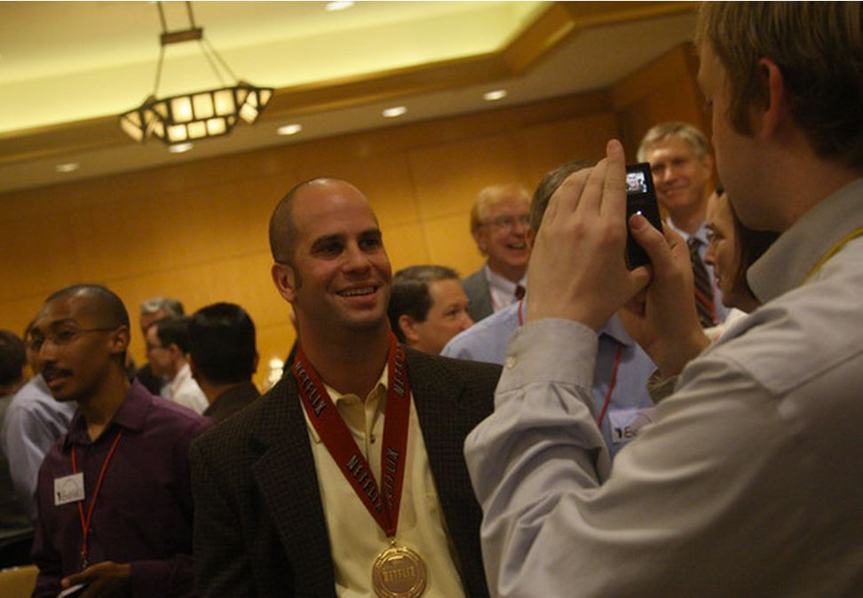
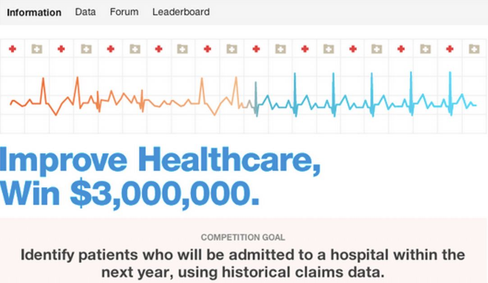
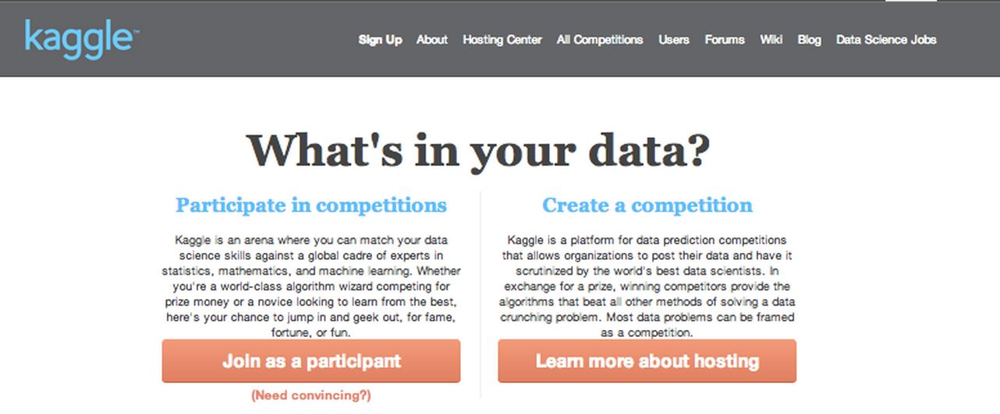
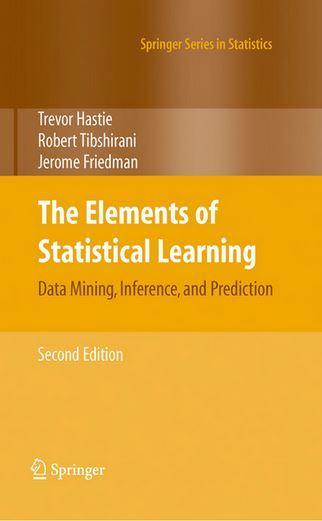
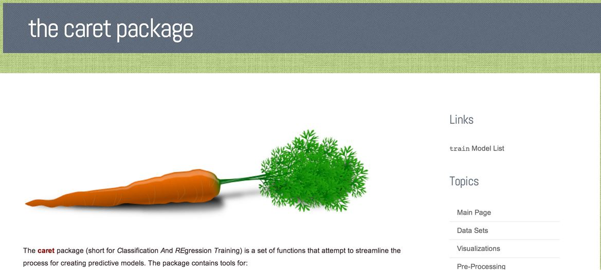
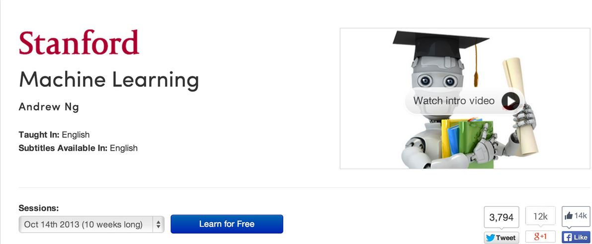

```{r setup, cache=FALSE, echo=FALSE, message=F, warning=F, tidy=FALSE}
require(knitr)
options(width=100)
opts_chunk$set(message=F, error=F, warning=F, comment=NA, fig.align='center', dpi=100, tidy=F, cache.path='.cache/', fig.path='fig/')

options(xtable.type='html')
knit_hooks$set(inline=function(x) {
    if(is.numeric(x)) {
        round(x, getOptions('digits'))
    } else {
        paste(as.character(x), collapse=', ')
    }
})
knit_hooks$set(plot=knitr:::hook_plot_html)
```

## About This Course

- This course covers the basic ideas behind machine learning/prediction
    - Study design - training vs. test sets
    - Conceptual issues - out of sample error, ROC curves
    - Practical implementation - the caret package
- What this course depends on
    - The Data Scientist's Toolbox
    - R Programming
- What would be useful
    - Exploratory analysis
    - Reporting Data and Reproducible Research
    - Regression models

---

## Who Predicts?

- Local governments -> pension payments
- Google -> whether you will click on an ad
- Amazon -> what movies you will watch
- Insurance companies -> what your risk of death is
- Johns Hopkins -> who will succeed in their programs

---

## Why Predict? Glory!



[http://www.zimbio.com/photos/Chris+Volinsky](http://www.zimbio.com/photos/Chris+Volinsky)

---

## Why Predict? Riches!



[http://www.heritagehealthprize.com/c/hhp](http://www.heritagehealthprize.com/c/hhp)

---

## Why Predict? For Sport!



[http://www.kaggle.com/](http://www.kaggle.com/)

---

## Why Predict? To Save Lives!


[http://www.oncotypedx.com/en-US/Home](http://www.oncotypedx.com/en-US/Home)

---

## A Useful (If a Bit Advanced) Book



A free version is available on the author's website.

[The elements of statistical learning](http://statweb.stanford.edu/~tibs/ElemStatLearn/)

---

## A Useful Package



[http://caret.r-forge.r-project.org/](http://caret.r-forge.r-project.org/)

---

## Machine Learning (More Advanced Material)



[https://www.coursera.org/course/ml](https://www.coursera.org/course/ml)

---

## Even More Resources

- [List of machine learning resources on Quora](https://www.quora.com/How-do-I-learn-machine-learning-1)
- [List of machine learning resources from Science](http://www.sciencemag.org/site/feature/data/compsci/machine_learning.xhtml)
- [Advances notes from MIT open courseware](http://ocw.mit.edu/courses/electrical-engineering-and-computer-science/6-867-machine-learning-fall-2006/lecture-notes/)
- [Advanced notes from CMU](http://www.stat.cmu.edu/~cshalizi/350/)
- [Kaggle - machine learning competitions](https://www.kaggle.com/)