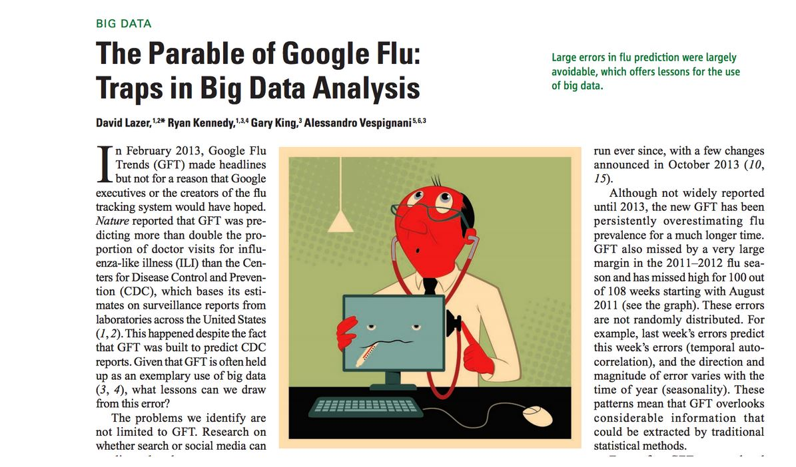
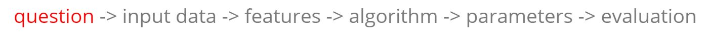
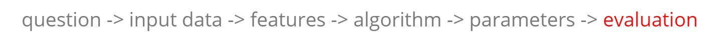

```{r setup, cache=FALSE, echo=FALSE, message=F, warning=F, tidy=FALSE}
require(knitr)
options(width=100)
opts_chunk$set(message=F, error=F, warning=F, comment=NA, fig.align='center', dpi=100, tidy=F, cache.path='.cache/', fig.path='fig/')

options(xtable.type='html')
knit_hooks$set(inline=function(x) {
    if(is.numeric(x)) {
        round(x, getOptions('digits'))
    } else {
        paste(as.character(x), collapse=', ')
    }
})
knit_hooks$set(plot=knitr:::hook_plot_html)
```

## The Central Dogma of Prediction


---

## What Can Go Wrong?



[http://www.sciencemag.org/content/343/6176/1203.full.pdf](http://www.sciencemag.org/content/343/6176/1203.full.pdf)

---

## Components of a Predictor


---

## SPAM Example



**Start with a general question**

Can I automatically detect emails that are SPAM and that are not?

**Make it concrete**

Can I use quantitative characteristics of the emails to classify them as SPAM/HAM?

---

## SPAM Example


[http://rss.acs.unt.edu/Rdoc/library/kernlab/html/spam.html](http://rss.acs.unt.edu/Rdoc/library/kernlab/html/spam.html)

---

## SPAM Example


**Dear Jeff,**

**Can you send me your address so I can send you the invitation?**

**Thanks,**

**Ben**

---

## SPAM Example


**Dear Jeff,**

**Can you send me your address so I can send you the invitation?**

**Thanks,**

**Ben**

Frequency of you = 2/17 = 0.118

---

## SPAM Example


```{r}
library(kernlab)
data(spam)
head(spam)
```

---

## SPAM Example


```{r}
plot(density(spam$your[spam$type=="nonspam"]),
     col="blue", main="", xlab="Frequency of 'your'")
lines(density(spam$your[spam$type=="spam"]), col="red")
```

---

## SPAM Example


**Our algorithm**

- Find the value _C_
- **Frequency of 'your' > C** predict "spam"

---

## SPAM Example


```{r}
plot(density(spam$your[spam$type=="nonspam"]),
     col="blue", main="", xlab="Frequency of 'your'")
lines(density(spam$your[spam$type=="spam"]), col="red")
abline(v=0.5, col="black")
```

---

## SPAM Example



```{r}
prediction <- ifelse(spam$your > 0.5, "spam", "nospam")
table(prediction, spam$type) / length(spam$type)
```

Accuracy $\approx 0.459 + 0.292 = 0.751$

---