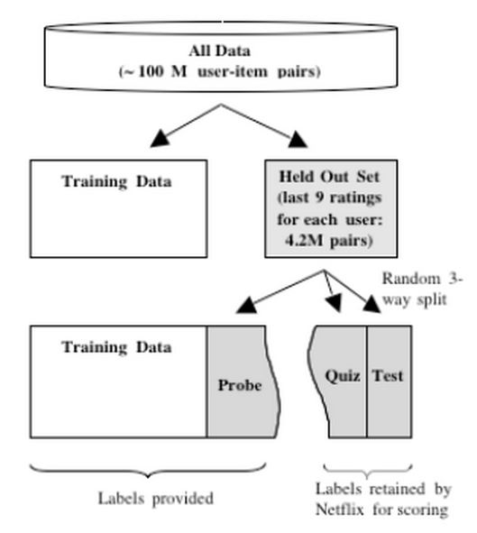

```{r setup, cache=FALSE, echo=FALSE, message=F, warning=F, tidy=FALSE}
require(knitr)
options(width=100)
opts_chunk$set(message=F, error=F, warning=F, comment=NA, fig.align='center', dpi=100, tidy=F, cache.path='.cache/', fig.path='fig/')

options(xtable.type='html')
knit_hooks$set(inline=function(x) {
    if(is.numeric(x)) {
        round(x, getOptions('digits'))
    } else {
        paste(as.character(x), collapse=', ')
    }
})
knit_hooks$set(plot=knitr:::hook_plot_html)
```

## Prediction Study Design

1. Define your error rate
2. Split data into:
    - Training
    - Test
    - Validation (optional)
3. On the training set pick features
    - Use cross-validation
4. On the training set pick prediction function
    - Use cross-validation
5. If no validation
    - Apply 1x to test set
6. If validation
    - Apply to test set and refine
    - Apply 1x to validation

---

## Know the Benchmarks


[http://www.heritagehealthprize.com/c/hhp/leaderboard](http://www.heritagehealthprize.com/c/hhp/leaderboard)

---

## Study Design



[http://www2.research.att.com/~volinsky/papers/ASAStatComp.pdf](http://www2.research.att.com/~volinsky/papers/ASAStatComp.pdf)

---

## Used by the Professionals


[http://www.kaggle.com/](http://www.kaggle.com/)

---

## Avoid Small Sample Sizes

- Suppose you are predicting a binary outcome
    - Diseased/health
    - Click on ad/not click on ad
- One classifier is flipping a coin
- Probability of perfect classification is approximately:
    - $\left(\frac{1}{2}\right)^{sample\ size}$
    - $n = 1$ flipping coin 50% chance of 100% accuracy
    - $n = 2$ flipping coin 25% chance of 100% accuracy
    - $n = 10$ flipping coin 0.10% chance of 100% accuracy

---

## Rules of Thumb for Prediction Study Design

- If you have a large sample size
    - 60% training
    - 20% test
    - 20% validation
- If you have a medium sample size
    - 60% training
    - 40% test
- If you have a small sample size
    - Do cross-validation
    - Report caveat of small sample size

---

## Some Principles to Remember

- Set the test/validation set aside and _don't look at it_
- In general _randomly_ sample training and test
- Your datasets must reflect structure of the problem
    - If predictions evolve with time split train/test in time chunks (called [backtesting](https://en.wikipedia.org/wiki/Backtesting) in finance)
- All subsets should reflect as much diversity as possible
    - Random assignment does this
    - You can also try to balance features, but this is tricky