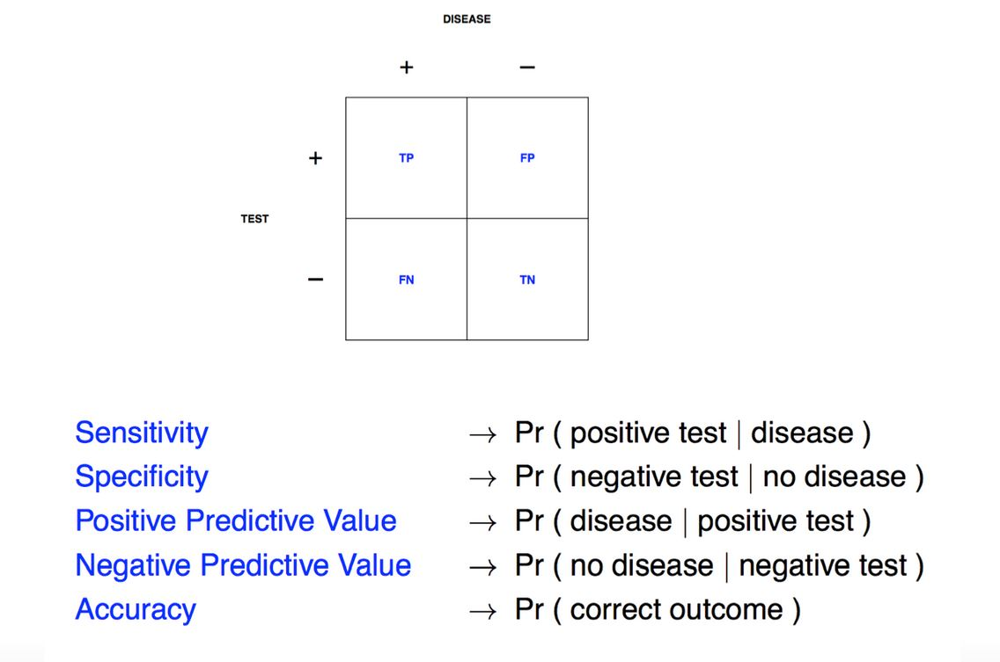
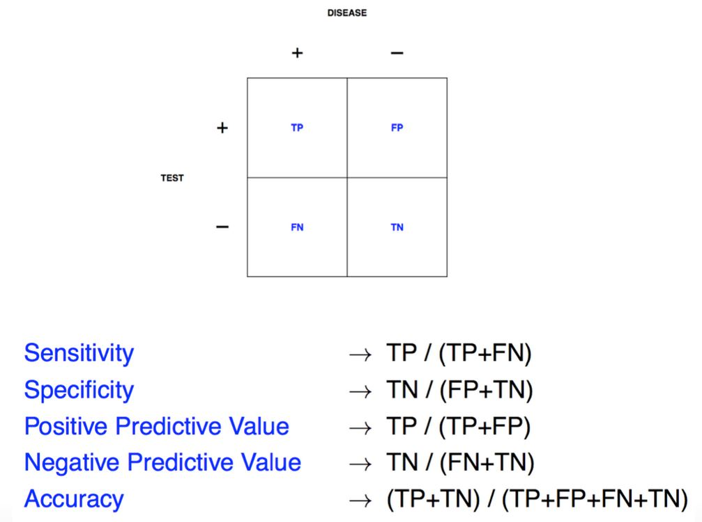
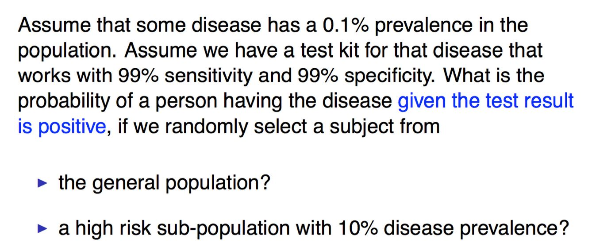
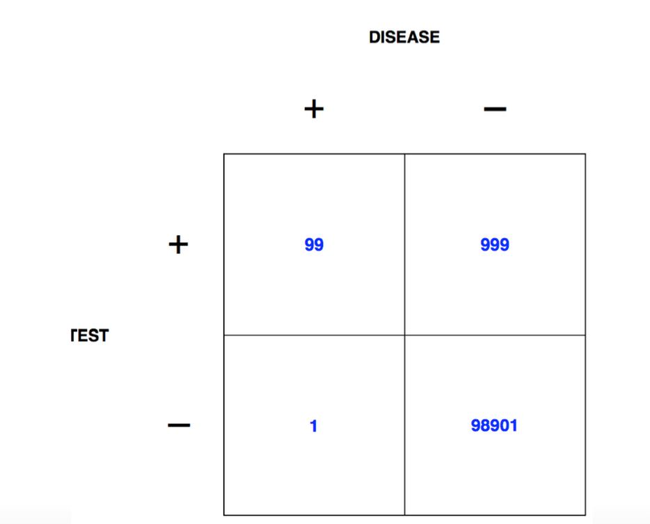
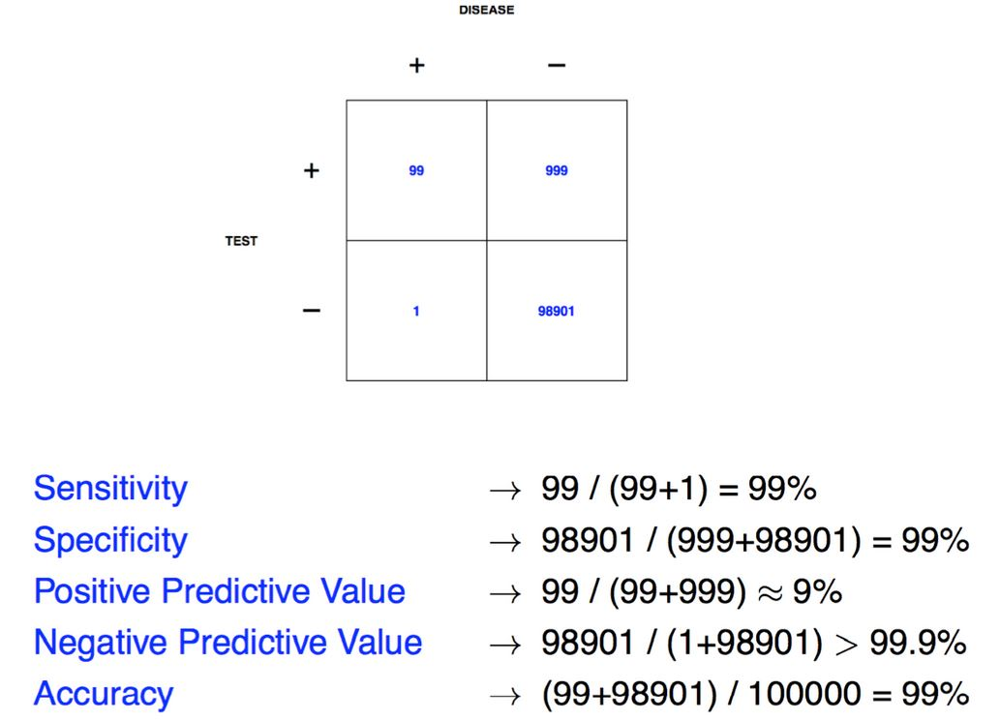
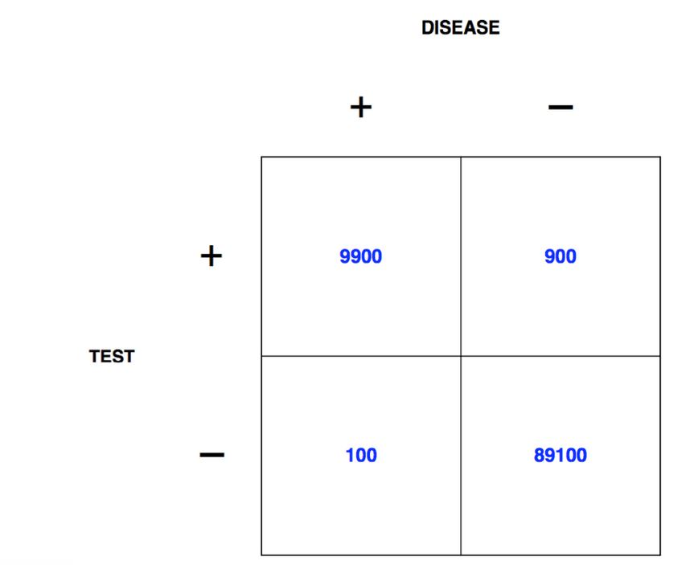
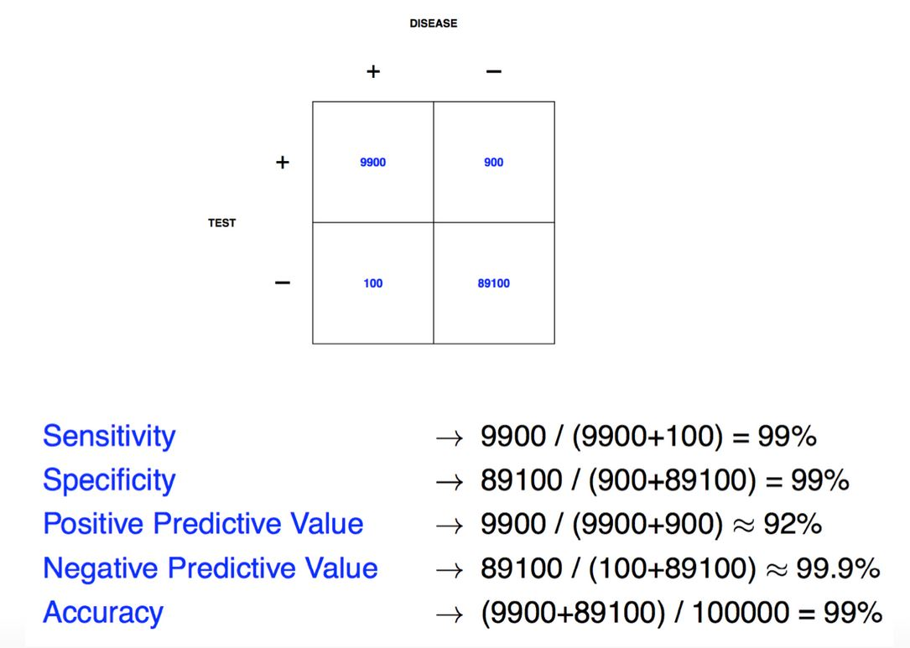

```{r setup, cache=FALSE, echo=FALSE, message=F, warning=F, tidy=FALSE}
require(knitr)
options(width=100)
opts_chunk$set(message=F, error=F, warning=F, comment=NA, fig.align='center', dpi=100, tidy=F, cache.path='.cache/', fig.path='fig/')

options(xtable.type='html')
knit_hooks$set(inline=function(x) {
    if(is.numeric(x)) {
        round(x, getOptions('digits'))
    } else {
        paste(as.character(x), collapse=', ')
    }
})
knit_hooks$set(plot=knitr:::hook_plot_html)
```

## Basic Terms

In general, **Positive** = identified and **negative** = rejected. Therefore:

- **True positive** - correctly identified
- **False positive** - incorrectly identified
- **True negative** - correctly rejected
- **False negative** - incorrectly rejected

_Medical testing example:_

- **True positive** - Sick people correctly diagnosed as sick
- **False positive** - Healthy people incorrectly identified as sick
- **True negative** - Healthy people correctly identified as healthy
- **False negative** - Sick people incorrectly identified as healthy

[https://en.wikipedia.org/wiki/Sensitivity_and_specificity](https://en.wikipedia.org/wiki/Sensitivity_and_specificity)

---

## Key Quantities



[https://en.wikipedia.org/wiki/Sensitivity_and_specificity](https://en.wikipedia.org/wiki/Sensitivity_and_specificity)

---

## Key Quantities as Fractions



[https://en.wikipedia.org/wiki/Sensitivity_and_specificity](https://en.wikipedia.org/wiki/Sensitivity_and_specificity)

---

## Screening Tests



[http://www.biostat.jhsph.edu/~iruczins/teaching/140.615/](http://www.biostat.jhsph.edu/~iruczins/teaching/140.615/)

---

## General Population



[http://www.biostat.jhsph.edu/~iruczins/teaching/140.615/](http://www.biostat.jhsph.edu/~iruczins/teaching/140.615/)

---

## General Population as Fractions



[http://www.biostat.jhsph.edu/~iruczins/teaching/140.615/](http://www.biostat.jhsph.edu/~iruczins/teaching/140.615/)

---

## At Risk Population



[http://www.biostat.jhsph.edu/~iruczins/teaching/140.615/](http://www.biostat.jhsph.edu/~iruczins/teaching/140.615/)

---

## At Risk Population as Fractions



[http://www.biostat.jhsph.edu/~iruczins/teaching/140.615/](http://www.biostat.jhsph.edu/~iruczins/teaching/140.615/)

---

## Key Public Health Issue


[http://www.biostat.jhsph.edu/~iruczins/teaching/140.615/](http://www.biostat.jhsph.edu/~iruczins/teaching/140.615/)

---

## Key Public Health Issue


---

## For Continuous Data

**Mean Squared Error (MSE):**

$$
\frac{1}{n}\sum_{i=1}^n(Prediction_i - Truth_i)^2
$$

**Root Mean Squared Error (RMSE):**

$$
\sqrt{\frac{1}{n}\sum_{i=1}^n(Prediction_i - Truth_i)^2}
$$

---

## Common Error Measures

1. Mean squared error (or root mean squared error)
    - Continuous data, sensitive to outliers
2. Median absolute deviation
    - Continuous data, often more robust
3. Sensitivity (recall)
    - If you want few missed positives
4. Specificity
    - If you want few negatives called positives
5. Accuracy
    - Weights false positives/negatives equally
6. Concordance
    - One example is [kappa](https://en.wikipedia.org/wiki/Cohen%27s_kappa)