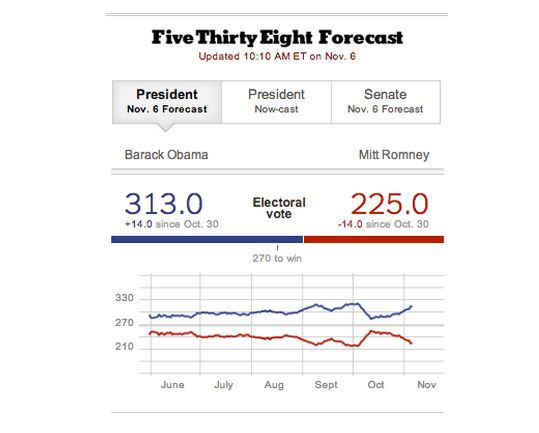
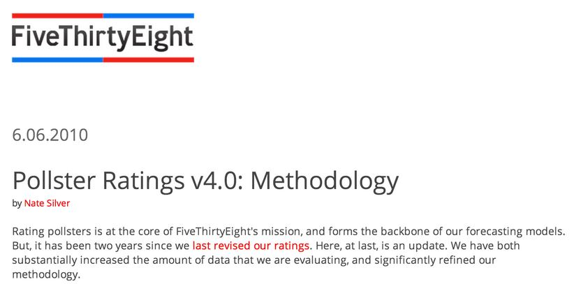
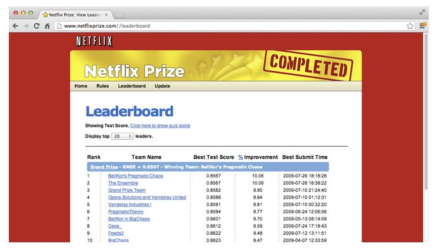
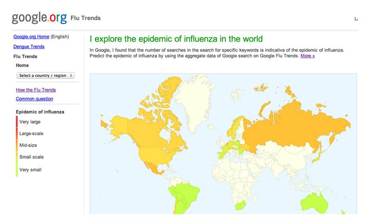
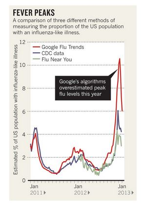
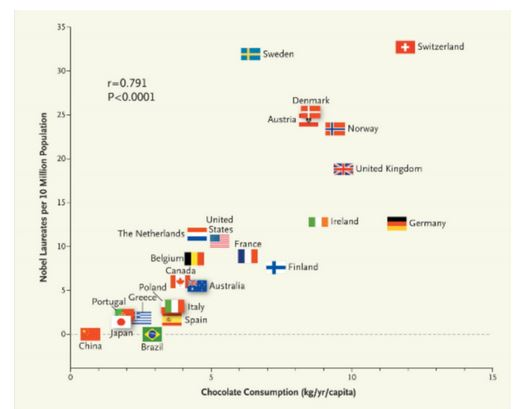

```{r setup, cache=FALSE, echo=FALSE, message=F, warning=F, tidy=FALSE}
require(knitr)
options(width=100)
opts_chunk$set(message=F, error=F, warning=F, comment=NA, fig.align='center', dpi=100, tidy=F, cache.path='.cache/', fig.path='fig/')

options(xtable.type='html')
knit_hooks$set(inline=function(x) {
    if(is.numeric(x)) {
        round(x, getOptions('digits'))
    } else {
        paste(as.character(x), collapse=', ')
    }
})
knit_hooks$set(plot=knitr:::hook_plot_html)
```

## A Successful Predictor



[fivethirtyeight.com](fivethirtyeight.com)

---

## Polling Data


[http://www.gallup.com/](http://www.gallup.com/)

---

## Weighting the Data



[http://www.fivethirtyeight.com/2010/06/pollster-ratings-v40-methodology.html](http://www.fivethirtyeight.com/2010/06/pollster-ratings-v40-methodology.html)

---

## Key Idea

#### To predict $X$, use data related to $X$

---

## Key Idea

#### To predict _player performance_, use data about _player performance_


---

## Key Idea

#### To predict _movie preferences_, use data about _movie preferences_



---

## Key Idea

#### To predict _hospitalizations_, use data about _hospitalizations_


---

## Not a Hard Rule

#### To predict _flu outbreaks_, use _Google searches_



---

## Looser connection = harder prediction


---

## Data Properties Matter



---

## Unrelated Data Is the Most Common Mistake



[http://www.nejm.org/doi/full/10.1056/NEJMon1211064](http://www.nejm.org/doi/full/10.1056/NEJMon1211064)