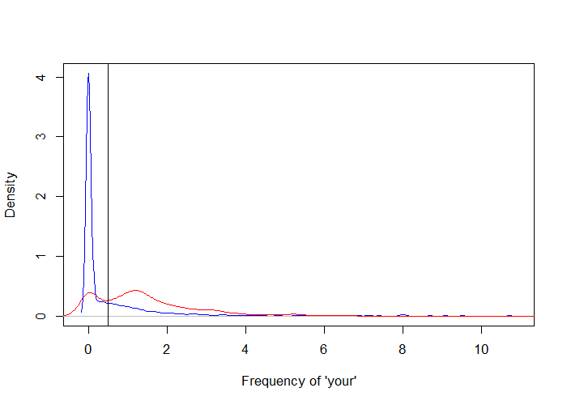

# What Is Prediction?


## The Central Dogma of Prediction


---

## What Can Go Wrong?


[http://www.sciencemag.org/content/343/6176/1203.full.pdf](http://www.sciencemag.org/content/343/6176/1203.full.pdf)

---

## Components of a Predictor


---

## SPAM Example


**Start with a general question**

Can I automatically detect emails that are SPAM and that are not?

**Make it concrete**

Can I use quantitative characteristics of the emails to classify them as SPAM/HAM?

---

## SPAM Example


[http://rss.acs.unt.edu/Rdoc/library/kernlab/html/spam.html](http://rss.acs.unt.edu/Rdoc/library/kernlab/html/spam.html)

---

## SPAM Example


**Dear Jeff,**

**Can you send me your address so I can send you the invitation?**

**Thanks,**

**Ben**

---

## SPAM Example


**Dear Jeff,**

**Can you send me your address so I can send you the invitation?**

**Thanks,**

**Ben**

Frequency of you = 2/17 = 0.118

---

## SPAM Example


```r
library(kernlab)
data(spam)
head(spam)
```

```
  make address  all num3d  our over remove internet order mail receive will people report addresses
1 0.00    0.64 0.64     0 0.32 0.00   0.00     0.00  0.00 0.00    0.00 0.64   0.00   0.00      0.00
2 0.21    0.28 0.50     0 0.14 0.28   0.21     0.07  0.00 0.94    0.21 0.79   0.65   0.21      0.14
3 0.06    0.00 0.71     0 1.23 0.19   0.19     0.12  0.64 0.25    0.38 0.45   0.12   0.00      1.75
4 0.00    0.00 0.00     0 0.63 0.00   0.31     0.63  0.31 0.63    0.31 0.31   0.31   0.00      0.00
5 0.00    0.00 0.00     0 0.63 0.00   0.31     0.63  0.31 0.63    0.31 0.31   0.31   0.00      0.00
6 0.00    0.00 0.00     0 1.85 0.00   0.00     1.85  0.00 0.00    0.00 0.00   0.00   0.00      0.00
  free business email  you credit your font num000 money hp hpl george num650 lab labs telnet
1 0.32     0.00  1.29 1.93   0.00 0.96    0   0.00  0.00  0   0      0      0   0    0      0
2 0.14     0.07  0.28 3.47   0.00 1.59    0   0.43  0.43  0   0      0      0   0    0      0
3 0.06     0.06  1.03 1.36   0.32 0.51    0   1.16  0.06  0   0      0      0   0    0      0
4 0.31     0.00  0.00 3.18   0.00 0.31    0   0.00  0.00  0   0      0      0   0    0      0
5 0.31     0.00  0.00 3.18   0.00 0.31    0   0.00  0.00  0   0      0      0   0    0      0
6 0.00     0.00  0.00 0.00   0.00 0.00    0   0.00  0.00  0   0      0      0   0    0      0
  num857 data num415 num85 technology num1999 parts pm direct cs meeting original project   re  edu
1      0    0      0     0          0    0.00     0  0   0.00  0       0     0.00       0 0.00 0.00
2      0    0      0     0          0    0.07     0  0   0.00  0       0     0.00       0 0.00 0.00
3      0    0      0     0          0    0.00     0  0   0.06  0       0     0.12       0 0.06 0.06
4      0    0      0     0          0    0.00     0  0   0.00  0       0     0.00       0 0.00 0.00
5      0    0      0     0          0    0.00     0  0   0.00  0       0     0.00       0 0.00 0.00
6      0    0      0     0          0    0.00     0  0   0.00  0       0     0.00       0 0.00 0.00
  table conference charSemicolon charRoundbracket charSquarebracket charExclamation charDollar
1     0          0          0.00            0.000                 0           0.778      0.000
2     0          0          0.00            0.132                 0           0.372      0.180
3     0          0          0.01            0.143                 0           0.276      0.184
4     0          0          0.00            0.137                 0           0.137      0.000
5     0          0          0.00            0.135                 0           0.135      0.000
6     0          0          0.00            0.223                 0           0.000      0.000
  charHash capitalAve capitalLong capitalTotal type
1    0.000      3.756          61          278 spam
2    0.048      5.114         101         1028 spam
3    0.010      9.821         485         2259 spam
4    0.000      3.537          40          191 spam
5    0.000      3.537          40          191 spam
6    0.000      3.000          15           54 spam
```

---

## SPAM Example


```r
plot(density(spam$your[spam$type=="nonspam"]),
     col="blue", main="", xlab="Frequency of 'your'")
lines(density(spam$your[spam$type=="spam"]), col="red")
```

<div class="rimage center"></div>

---

## SPAM Example


**Our algorithm**

- Find the value _C_
- **Frequency of 'your' > C** predict "spam"

---

## SPAM Example


```r
plot(density(spam$your[spam$type=="nonspam"]),
     col="blue", main="", xlab="Frequency of 'your'")
lines(density(spam$your[spam$type=="spam"]), col="red")
abline(v=0.5, col="black")
```

<div class="rimage center"></div>

---

## SPAM Example


```r
prediction <- ifelse(spam$your > 0.5, "spam", "nospam")
table(prediction, spam$type) / length(spam$type)
```

```
          
prediction   nonspam      spam
    nospam 0.4590306 0.1017170
    spam   0.1469246 0.2923278
```

Accuracy $\approx 0.459 + 0.292 = 0.751$

---
