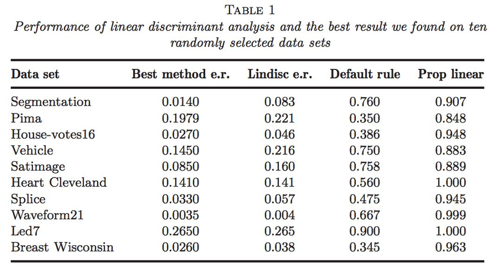
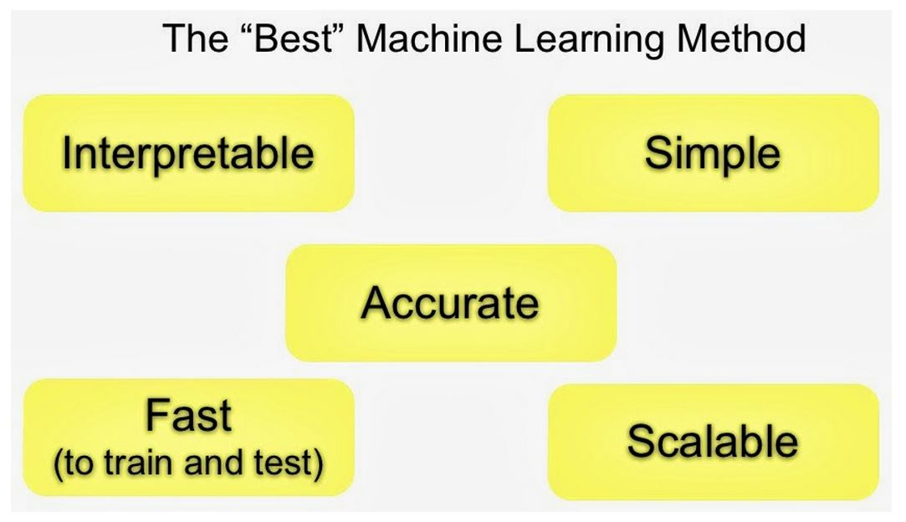
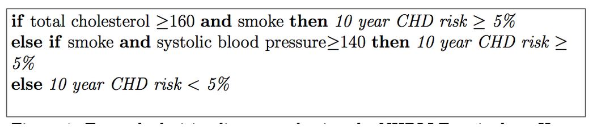
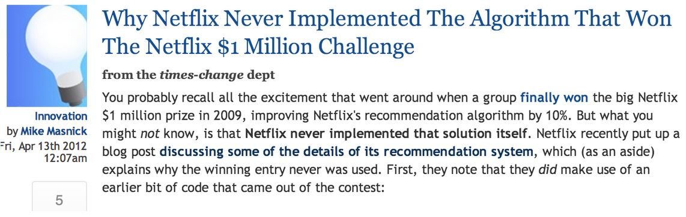

# Relative Importance of Steps

## Relative Order of Importance

---

## An Important Point

---

## Garbage In = Garbage Out

1. May be easy (movie ratings -> new movie ratings)
2. May be harder (gene expression data -> disease)
3. Depends on what is a "good prediction"
4. Often [more data > better models](https://www.youtube.com/watch?v=yvDCzhbjYWs)
5. The most important step!

---

## Features Matter!

**Properties of good features**

- Lead to data compression
- Retain relevant information
- Are created based on expert application knowledge

**Common mistakes**

- Trying to automate feature selection
- Not paying attention to data-specific quirks
- Throwing away information unnecessarily

---

## May Be Automated with Care

[http://arxiv.org/pdf/1112.6209v5.pdf](http://arxiv.org/pdf/1112.6209v5.pdf)

---

## Algorithms Matter Less than You'd Think

[http://arxiv.org/pdf/math/0606441.pdf](http://arxiv.org/pdf/math/0606441.pdf)

---

## Issues to Consider

[http://strata.oreilly.com/2013/09/gaining-access-to-the-best-machine-learning-methods.html](http://strata.oreilly.com/2013/09/gaining-access-to-the-best-machine-learning-methods.html)

---

## Prediction Is About Accuracy Tradeoffs

- Interpretability versus accuracy
- Speed versus accuracy
- Simplicity versus accuracy
- Scalability versus accuracy

---

## Interpretability Matters

[http://www.cs.cornell.edu/~chenhao/pub/mldg-0815.pdf](http://www.cs.cornell.edu/~chenhao/pub/mldg-0815.pdf)

---

## Scalability Matters

[http://www.techdirt.com/blog/innovation/articles/20120409/03412518422/](http://www.techdirt.com/blog/innovation/articles/20120409/03412518422/)

[http://techblog.netflix.com/2012/04/netflix-recommendations-beyond-5-stars.html](http://techblog.netflix.com/2012/04/netflix-recommendations-beyond-5-stars.html)

---
