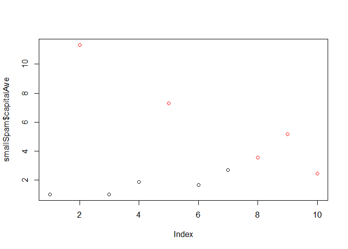

# In Sample and Out of Sample Error


## In Sample Versus Out of Sample

**In Sample Error:** The error rate you get on the same dataset you used to build your predictor. Sometimes called resubstitution error.

**Out of Sample Error:** The error rate you get on a new dataset. Sometimes called generalization error.

**Key ideas**

1. Out of sample error is what you care about
2. In sample error < out of sample error
3. The reason is overfitting
    - Matching your algorithm to the data you have
    
---

## In Sample Versus Out of Sample Errors


```r
library(kernlab)
data(spam)
set.seed(333)
smallSpam <- spam[sample(dim(spam)[1], size=10),]
spamLabel <- (smallSpam$type=="spam") * 1 + 1
plot(smallSpam$capitalAve, col=spamLabel)
```

<div class="rimage center"></div>

---

## Prediction Rule 1

- `capitalAve` > 2.7 = "spam"
- `capitalAve` < 2.40 = "nonspam"
- `capitalAve` between 2.40 and 2.45 = "spam"
- `capitalAve` between 2.45 and 2.7 = "nonspam"

---

## Apply Rule 1 to `smallSpam`


```r
rule1 <- function(x) {
    prediction <- rep(NA, length(x))
    prediction[x > 2.7] <- "spam"
    prediction[x < 2.40] <- "nonspam"
    prediction[(x >= 2.40 & x <= 2.45)] <- "spam"
    prediction[(x > 2.45 & x <= 2.70)] <- "nonspam"
    return(prediction)
}
table(rule1(smallSpam$capitalAve), smallSpam$type)
```

```
         
          nonspam spam
  nonspam       5    0
  spam          0    5
```

---

## Prediction Rule 2

- `capitalAve` > 2.80 = "spam"
- `capitalAve` $\le$ 2.80 = "nonspam"

---

## Apply Rule 1 to `smallSpam`


```r
rule2 <- function(x) {
    prediction <- rep(NA, length(x))
    prediction[x > 2.8] <- "spam"
    prediction[x <= 2.8] <- "nonspam"
    return(prediction)
}
table(rule2(smallSpam$capitalAve), smallSpam$type)
```

```
         
          nonspam spam
  nonspam       5    1
  spam          0    4
```

---

## Apply to Complete Spam Data


```r
table(rule1(spam$capitalAve), spam$type)
```

```
         
          nonspam spam
  nonspam    2141  588
  spam        647 1225
```

```r
table(rule2(spam$capitalAve), spam$type)
```

```
         
          nonspam spam
  nonspam    2224  642
  spam        564 1171
```

```r
mean(rule1(spam$capitalAve)==spam$type)
```

```
[1] 0.7315801
```

```r
mean(rule2(spam$capitalAve)==spam$type)
```

```
[1] 0.7378831
```

---

## Look at Accuracy


```r
sum(rule1(spam$capitalAve)==spam$type)
```

```
[1] 3366
```

```r
sum(rule2(spam$capitalAve)==spam$type)
```

```
[1] 3395
```

---

## What's going on?

**Overfitting**

- Data have two parts
    - Signal
    - Noise
- The goal of a predictor is to find signal
- You can always design a perfect in-sample predictor
- You capture both signal + noise when you do that
- Predictor won't perform as well on new samples

[http://en.wikipedia.org/wiki/Overfitting](http://en.wikipedia.org/wiki/Overfitting)
