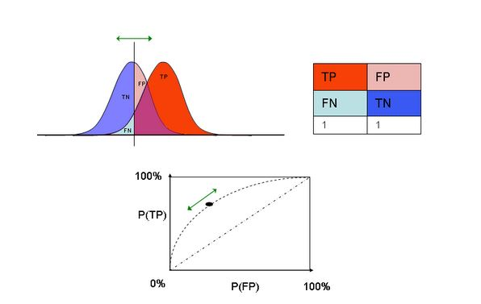
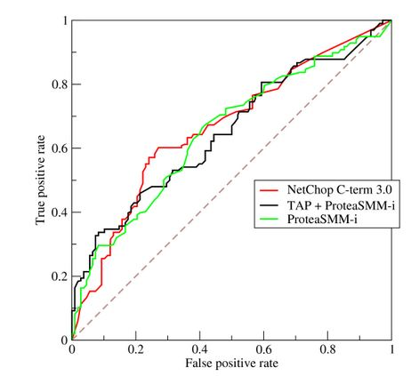
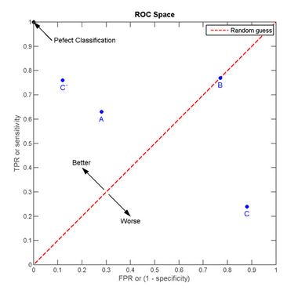

# ROC Curves

## Why a Curve?

- In binary classification you are predicting one of two categories
    - Alive/dead
    - Click on ad/don't click on ad
- But your predictions are often quantitative
    - Probability of being alive
    - Prediction on a scale from 1 to 10
- The _cutoff_ you choose gives different results

---

## ROC Curves

[http://en.wikipedia.org/wiki/Receiver_operating_characteristic](http://en.wikipedia.org/wiki/Receiver_operating_characteristic)

---

## An Example

[http://en.wikipedia.org/wiki/Receiver_operating_characteristic](http://en.wikipedia.org/wiki/Receiver_operating_characteristic)

---

## Area Under the Curve

- AUC = 0.5: random guessing
- AUC = 1: perfect classifier
- In general AUC of above 0.8 is considered "good"

[http://en.wikipedia.org/wiki/Receiver_operating_characteristic](http://en.wikipedia.org/wiki/Receiver_operating_characteristic)

---

## What is Good?

[http://en.wikipedia.org/wiki/Receiver_operating_characteristic](http://en.wikipedia.org/wiki/Receiver_operating_characteristic)

---

