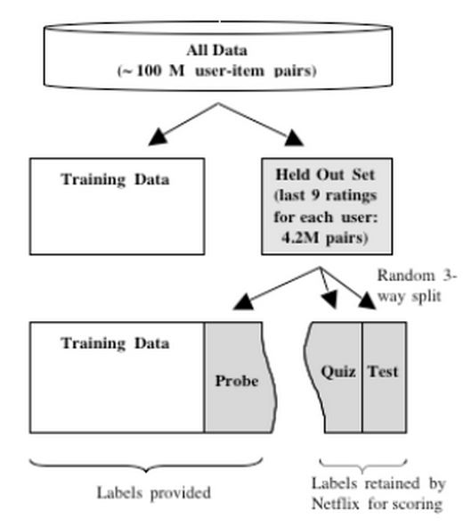
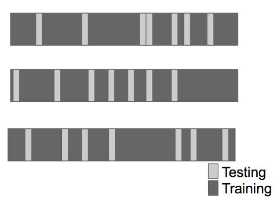
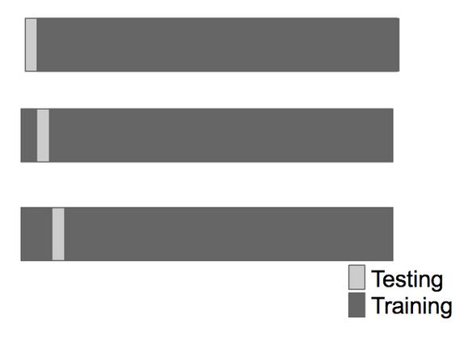

# Cross-Validation

## Study Design

[http://www2.research.att.com/~volinsky/papers/ASAStatComp.pdf](http://www2.research.att.com/~volinsky/papers/ASAStatComp.pdf)

---

## Key Idea

1. Accuracy on the training set (resubstitution accuracy) is optimistic
2. A better estimate comes from an independent set (test set accuracy)
3. But we can't use the test set when building the model or it becomes part of the training set
4. So we estimate the test set accuracy with the training set

---

## Cross-Validation

_Approach:_

1. Use the training set
2. Split it into training/test sets
3. Build a model on the training set
4. Evaluate on the test set
5. Repeat and average the estimated errors

_Used for:_

1. Picking variables to include in a model
2. Picking the type of prediction function to use
3. Picking the parameters in the prediction function
4. Comparing different predictors

---

## Random Subsampling

---

## K-fold

---

## Leave One Out

---

## Considerations

- For time series data, the data must be used in "chunks"
- For k-fold cross-validation
    - Larger k = less bias, more variance
    - Smaller k = more bias, less variance
- Random sampling must be done _without replacement_
- Random sampling with replacement is the _bootstrap_
    - Underestimates the error
    - Can be corrected, but it is complicated ([0.632 + Bootstrap](https://www.jstor.org/stable/2965703))
- If you cross-validate to pick the predictors estimate you must estimate errors on independent data
