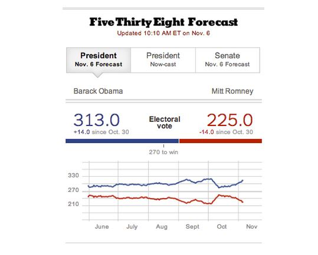
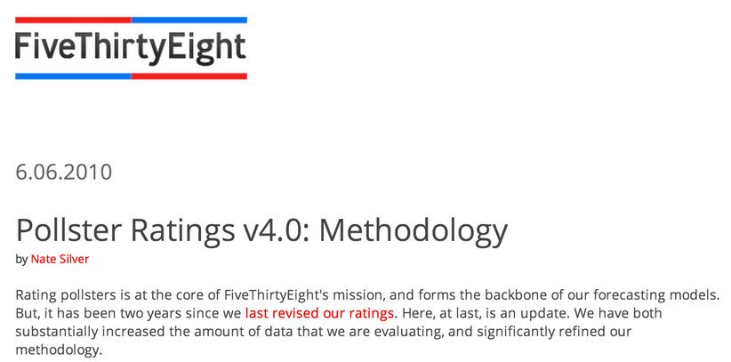
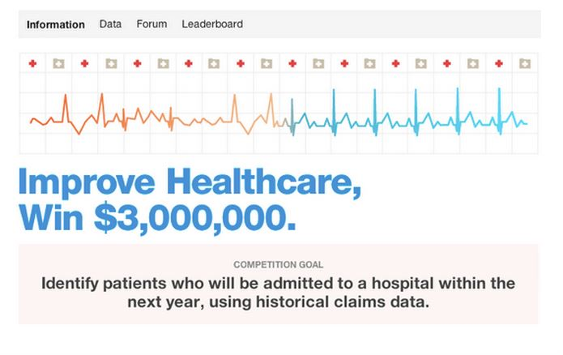
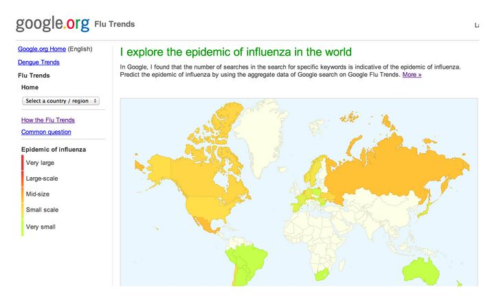
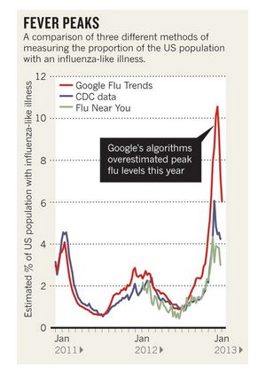
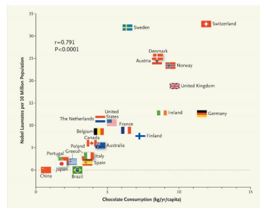

# What Data Should You Use?

## A Successful Predictor

[fivethirtyeight.com](fivethirtyeight.com)

---

## Polling Data

[http://www.gallup.com/](http://www.gallup.com/)

---

## Weighting the Data

[http://www.fivethirtyeight.com/2010/06/pollster-ratings-v40-methodology.html](http://www.fivethirtyeight.com/2010/06/pollster-ratings-v40-methodology.html)

---

## Key Idea

#### To predict $X$, use data related to $X$

---

## Key Idea

#### To predict _player performance_, use data about _player performance_

---

## Key Idea

#### To predict _movie preferences_, use data about _movie preferences_

---

## Key Idea

#### To predict _hospitalizations_, use data about _hospitalizations_

---

## Not a Hard Rule

#### To predict _flu outbreaks_, use _Google searches_

---

## Looser connection = harder prediction

---

## Data Properties Matter

---

## Unrelated Data Is the Most Common Mistake

[http://www.nejm.org/doi/full/10.1056/NEJMon1211064](http://www.nejm.org/doi/full/10.1056/NEJMon1211064)
