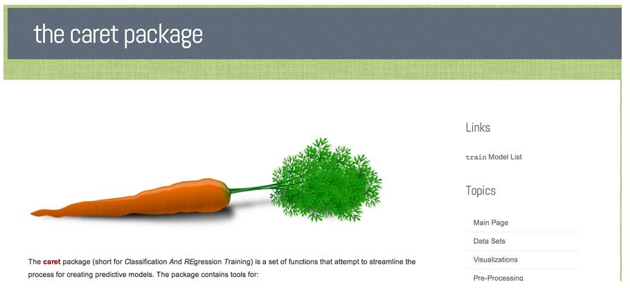
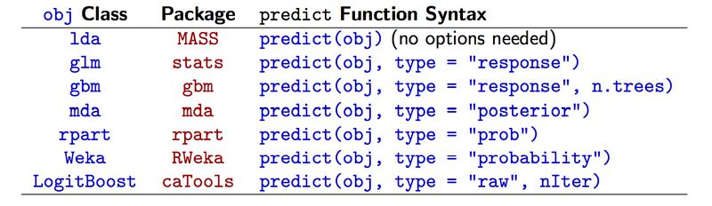

```{r setup, cache=FALSE, echo=FALSE, message=F, warning=F, tidy=FALSE}
require(knitr)
options(width=100)
opts_chunk$set(message=F, error=F, warning=F, comment=NA, fig.align='center', dpi=100, tidy=F, cache.path='.cache/', fig.path='fig/')

options(xtable.type='html')
knit_hooks$set(inline=function(x) {
    if(is.numeric(x)) {
        round(x, getOptions('digits'))
    } else {
        paste(as.character(x), collapse=', ')
    }
})
knit_hooks$set(plot=knitr:::hook_plot_html)
```

## The Caret R Package



[http://caret.r-forge.r-project.org/](http://caret.r-forge.r-project.org/)

---

## Caret Functionality

- Some preprocessing (cleaning)
    - `preProcess`
- Data splitting
    - `createDataPartition`
    - `createResample`
    - `createTimeSeries`
- Training/testing functions
    - `train`
    - `predict`
- Model comparison
    - `confusionMatrix`

---

## Machine Learning Algorithms in R

- Linear discriminant analysis
- Regression
- Naive Bayes
- Support vector machines
- Classification and regression trees
- Random forests
- Boosting
- etc.

---

## Why Caret?



[http://www.edii.uclm.es/~useR-2013/Tutorials/kuhn/user_caret_2up.pdf](http://www.edii.uclm.es/~useR-2013/Tutorials/kuhn/user_caret_2up.pdf)

---

## SPAM Example: Data splitting

```{r}
library(caret)
library(kernlab)
data(spam)
inTrain <- createDataPartition(y=spam$type, p=0.75, list=F)
training <- spam[inTrain,]
testing <- spam[-inTrain,]
dim(training)
```

---

## SPAM Example: Fit a Model

```{r}
set.seed(32343)
modelFit <- train(type ~ ., data=training, method="glm")
modelFit
```

---

## SPAM Example: Final Model

```{r}
modelFit$finalModel
```

---

## SPAM Example: Prediction

```{r}
predictions <- predict(modelFit, newdata=testing)
predictions
```

---

## SPAM Example: Confusion Matrix

```{r}
confusionMatrix(predictions, testing$type)
```

---

## Further Information

- Caret tutorials
    - [http://www.edii.uclm.es/~useR-2013/Tutorials/kuhn/user_caret_2up.pdf](http://www.edii.uclm.es/~useR-2013/Tutorials/kuhn/user_caret_2up.pdf)
    - [http://cran.r-project.org/web/packages/caret/vignettes/caret.pdf](http://cran.r-project.org/web/packages/caret/vignettes/caret.pdf)
- A paper introducting the caret package
    - [http://www.jstatsoft.org/v28/i05/paper](http://www.jstatsoft.org/v28/i05/paper)