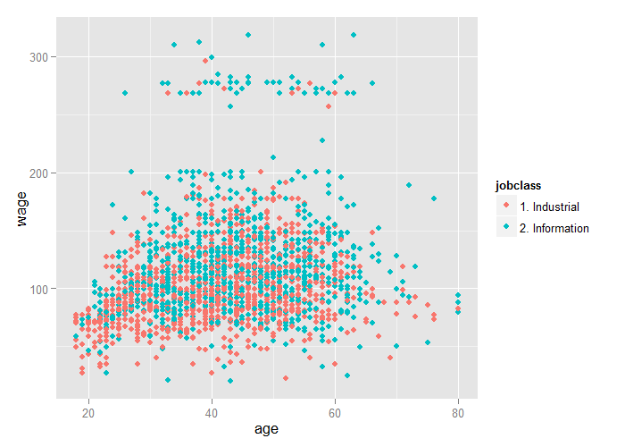
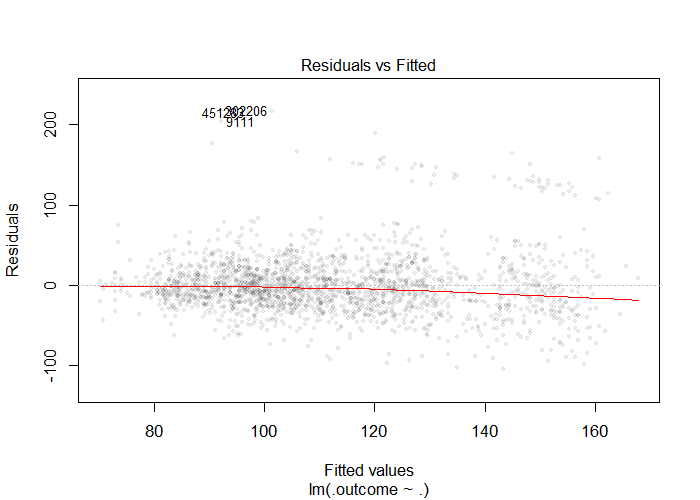

# Plotting Predictors


## Example: Predicting Wages


Image Credit [http://www.cahs-media.org/the-high-cost-of-low-wages](http://www.cahs-media.org/the-high-cost-of-low-wages)

Data from: [ISLR package](https://cran.r-project.org/web/packages/ISLR/) from the book: [Introduction to Statistical Learning](http://www-bcf.usc.edu/~gareth/ISL/)

---

## Example: Wage Data


```r
library(ISLR)
library(ggplot2)
library(caret)
data(Wage)
summary(Wage)
```

```
      year           age               sex                    maritl           race     
 Min.   :2003   Min.   :18.00   1. Male  :3000   1. Never Married: 648   1. White:2480  
 1st Qu.:2004   1st Qu.:33.75   2. Female:   0   2. Married      :2074   2. Black: 293  
 Median :2006   Median :42.00                    3. Widowed      :  19   3. Asian: 190  
 Mean   :2006   Mean   :42.41                    4. Divorced     : 204   4. Other:  37  
 3rd Qu.:2008   3rd Qu.:51.00                    5. Separated    :  55                  
 Max.   :2009   Max.   :80.00                                                           
                                                                                        
              education                     region               jobclass               health    
 1. < HS Grad      :268   2. Middle Atlantic   :3000   1. Industrial :1544   1. <=Good     : 858  
 2. HS Grad        :971   1. New England       :   0   2. Information:1456   2. >=Very Good:2142  
 3. Some College   :650   3. East North Central:   0                                              
 4. College Grad   :685   4. West North Central:   0                                              
 5. Advanced Degree:426   5. South Atlantic    :   0                                              
                          6. East South Central:   0                                              
                          (Other)              :   0                                              
  health_ins      logwage           wage       
 1. Yes:2083   Min.   :3.000   Min.   : 20.09  
 2. No : 917   1st Qu.:4.447   1st Qu.: 85.38  
               Median :4.653   Median :104.92  
               Mean   :4.654   Mean   :111.70  
               3rd Qu.:4.857   3rd Qu.:128.68  
               Max.   :5.763   Max.   :318.34  
                                               
```

---

## Get Training / Test Sets


```r
inTrain <- createDataPartition(y=Wage$wage, p=0.7, list=F)
training <- Wage[inTrain,]
testing <- Wage[-inTrain,]
dim(training)
```

```
[1] 2102   12
```

```r
dim(testing)
```

```
[1] 898  12
```

---

## Feature Plot (`caret` Package)


```r
featurePlot(x=training[,c("age","education","jobclass")],
            y=training$wage,
            plot="pairs")
```

<div class="rimage center"></div>

---

## Qplot (`ggplot2` Package)


```r
qplot(age, wage, data=training)
```

<div class="rimage center"></div>

---

## Qplot with Color (`ggplot2` Package)


```r
qplot(age, wage, color=jobclass, data=training)
```

<div class="rimage center"></div>

---

## Add Regression Smoothers (`ggplot` Package)


```r
qq <- qplot(age, wage, color=education, data=training)
qq + geom_smooth(method="lm", formula=y ~ x)
```

<div class="rimage center"></div>

---

## `cut2`, Making Factors (`hmisc` package)


```r
library(Hmisc)
cutWage <- cut2(training$wage, g=3)
table(cutWage)
```

```
cutWage
[ 20.1, 92.9) [ 92.9,118.9) [118.9,318.3] 
          701           724           677 
```

---

## Boxplots with `cut2`


```r
p1 <- qplot(cutWage, age, data=training, fill=cutWage, geom=c("boxplot"))
p1
```

<div class="rimage center"></div>

---

## Boxplots with Points Overlayed


```r
library(gridExtra)
p2 <- qplot(cutWage, age, data=training, fill=cutWage, geom=c("boxplot","jitter"))
grid.arrange(p1, p2, ncol=2)
```

<div class="rimage center"></div>

---

## Tables


```r
t1 <- table(cutWage, training$jobclass)
t1
```

```
               
cutWage         1. Industrial 2. Information
  [ 20.1, 92.9)           440            261
  [ 92.9,118.9)           376            348
  [118.9,318.3]           274            403
```

```r
prop.table(t1, 1)
```

```
               
cutWage         1. Industrial 2. Information
  [ 20.1, 92.9)     0.6276748      0.3723252
  [ 92.9,118.9)     0.5193370      0.4806630
  [118.9,318.3]     0.4047267      0.5952733
```

---

## Density Plots


```r
qplot(wage, color=education, data=training, geom="density")
```

<div class="rimage center"></div>

---

## Notes and Further Reading

- Make your plots only in the training set
    - Don't use the test set for exploration!
- Things you should be looking for
    - Imbalance in outcomes / predictors
    - Outliers
    - Groups of points not explained by a predictor
    - Skewed variables
- [ggplot2 tutorial](http://rstudio-pubs-static.s3.amazonaws.com/2176_75884214fc524dc0bc2a140573da38bb.html)
- [caret visializations](https://topepo.github.io/caret/visualizations.html)
