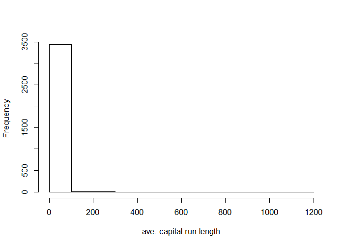
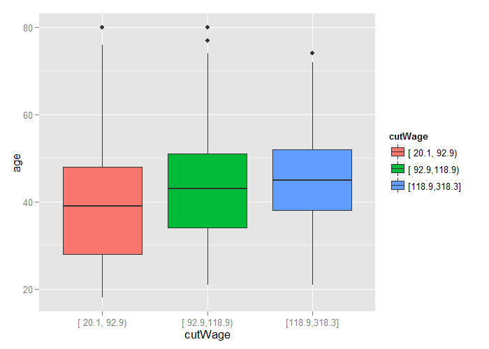

# Basic Preprocessing


## Why Preprocess?


```r
library(caret)
library(kernlab)
data(spam)
inTrain <- createDataPartition(y=spam$type, p=0.75, list=F)
training <- spam[inTrain,]
testing <- spam[-inTrain,]
hist(training$capitalAve, main="", xlab="ave. capital run length")
```

<div class="rimage center"></div>

---

## Why Preprocess?


```r
mean(training$capitalAve)
```

```
[1] 4.886625
```

```r
sd(training$capitalAve)
```

```
[1] 27.45856
```

---

## Standardizing


```r
trainCapAve <- training$capitalAve
trainCapAveS <- (trainCapAve - mean(trainCapAve)) / sd(trainCapAve)
mean(trainCapAveS)
```

```
[1] -9.804749e-18
```

```r
sd(trainCapAveS)
```

```
[1] 1
```

---

## Standardizing - Test Set


```r
testCapAve <- testing$capitalAve
testCapAveS <- (testCapAve - mean(trainCapAve)) / sd(trainCapAve)
mean(testCapAveS)
```

```
[1] 0.04442427
```

```r
sd(testCapAveS)
```

```
[1] 1.530242
```

---

## Standardizing - `preProcess` Function


```r
preObj <- preProcess(training[,-58], method=c("center","scale"))
trainCapAveS <- predict(preObj, training[,-58])$capitalAve
mean(trainCapAveS)
```

```
[1] -9.804749e-18
```

```r
sd(trainCapAveS)
```

```
[1] 1
```

---

## Standardizing - `preProcess` Function


```r
testCapAveS <- predict(preObj, testing[,-58])$capitalAve
mean(testCapAveS)
```

```
[1] 0.04442427
```

```r
sd(testCapAveS)
```

```
[1] 1.530242
```

---

## Standardizing - `preProcess` Argument


```r
set.seed(32343)
modelFit <- train(type ~ ., training, preProcess=c("center","scale"),
                  method="glm")
modelFit
```

```
Generalized Linear Model 

3451 samples
  57 predictor
   2 classes: 'nonspam', 'spam' 

Pre-processing: centered, scaled 
Resampling: Bootstrapped (25 reps) 
Summary of sample sizes: 3451, 3451, 3451, 3451, 3451, 3451, ... 
Resampling results

  Accuracy   Kappa      Accuracy SD  Kappa SD 
  0.9243825  0.8408017  0.005078642  0.0106603

 
```

---

## Standardizing - Box-Cox Transforms


```r
preObj <- preProcess(training[,-58], method=c("BoxCox"))
trainCapAveS <- predict(preObj, training[,-58])$capitalAve
par(mfrow=c(1,2))
hist(trainCapAveS)
qqnorm(trainCapAveS)
```

<div class="rimage center"></div>

---

## Standardizing - Imputing Data


```r
set.seed(13343)

# Make some values NA
training$capAve <- training$capitalAve
selectNA <- rbinom(dim(training)[1], size=1, prob=0.05)==1
training$capAve[selectNA] <- NA

## Impute and standardize
preObj <- preProcess(training[,-58], method="knnImpute")
capAve <- predict(preObj, training[,-58])$capAve

## Standardize true values
capAveTruth <- training$capitalAve
capAveTruth <- (capAveTruth - mean(capAveTruth)) / sd(capAveTruth)
```

---

## Standardizing - Imputing Data


```r
quantile(capAve - capAveTruth)
```

```
          0%          25%          50%          75%         100% 
-18.43656378  -0.02513190  -0.01567184   0.00449620   8.90365994 
```

```r
quantile((capAve - capAveTruth)[selectNA])
```

```
           0%           25%           50%           75%          100% 
-18.436563777  -0.035721602  -0.008581452   0.025084159   0.447689848 
```

```r
quantile((capAve - capAveTruth)[!selectNA])
```

```
          0%          25%          50%          75%         100% 
-0.033075662 -0.025024548 -0.015839570  0.003550194  8.903659944 
```

---

## Notes and Further Reading

- Training and test must be processed in the same way
- Test transformations will likely be imperfect
    - Especially if the test / training sets were collected at different times
- Careful when trainsforming factor variables!
- [Preprocessing with caret](https://topepo.github.io/caret/preprocess.html)
