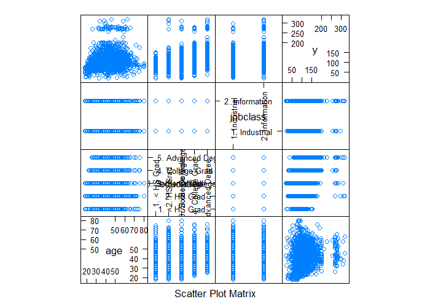
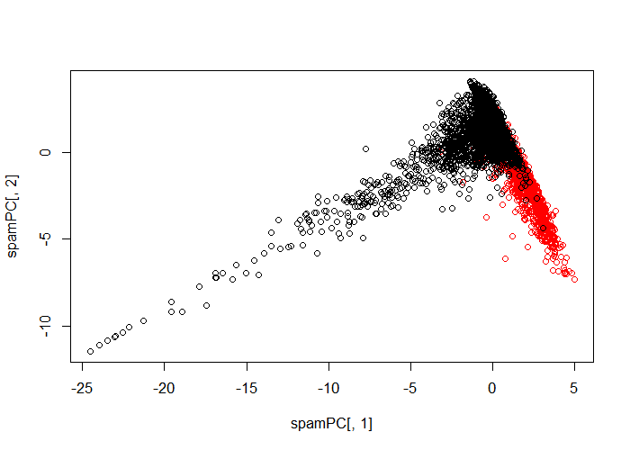

# Preprocessing with PCA


## Correlated Predictors


```r
set.seed(32323)
library(caret)
library(kernlab)
data(spam)
inTrain <- createDataPartition(y=spam$type, p=0.75, list=F)
training <- spam[inTrain,]
testing <- spam[-inTrain,]

M <- abs(cor(training[,-58]))
diag(M) <- 0
which(M > 0.8, arr.ind=T)
```

```
       row col
num857  32  31
num415  34  31
telnet  31  32
num415  34  32
direct  40  32
telnet  31  34
num857  32  34
direct  40  34
num857  32  40
num415  34  40
```

---

## Correlated Predictors


```r
names(spam)[c(34,32)]
```

```
[1] "num415" "num857"
```

```r
plot(spam[,34],spam[,32])
```

<div class="rimage center"></div>

---

## Basic PCA Idea

- We might not need every predictor
- A weighted combination of predictors might be better
- We should pick this combination to capture the "most information" possible
- Benefits
    - Reduced number of predictors
    - Reduced noise (due to averaging)

---

## We Could Rotate the Plot

$$
X = 0.71 \times \mbox{num}415 + 0.71 \times \mbox{num}857 \\
Y = 0.71 \times \mbox{num}415 - 0.71 \times \mbox{num}857
$$


```r
X <- 0.71 * training$num415 + 0.71 * training$num857
Y <- 0.71 * training$num415 - 0.71 * training$num857
plot(X, Y)
```

<div class="rimage center"></div>

---

## Related Problems

You have multivariate variables $X_1,...X_n$ so $X_1 = (X_{11},...,X{1m})$

- Find a new set of multivariate variables that are uncorrelated and explain as much variance as possible
- If you put all the variables together in one matrix, find the best matrix created with fewer variables (lower rank) that explains the original data

The first goal is **statistical** and the second goal is **data compression**

---

## Related Solutions - PCA/SVD

**SVD**

If $X$ is a matrix with each variable in a column and each observation in a row then the SVD is a "matrix decomposition"

$$
X = UDV^T
$$

where the columns of $U$ are orthogonal (left singular vectors), the columns of $V$ ae orthogonal (right singular vectors) and $D$ is a diagonal matrix (singular values)

**PCA**

The principal components are equal to the right singular values if you first scale (subtract the mean, divide by the standard deviation) the variables

---

## Principal Components in R - `prcomp`


```r
smallSpam <- spam[,c(34,32)]
prComp <- prcomp(smallSpam)
plot(prComp$x[,1], prComp$x[,2])
```

<div class="rimage center"></div>

---

## Principal Components in R - `prcomp`


```r
prComp$rotation
```

```
             PC1        PC2
num415 0.7080625  0.7061498
num857 0.7061498 -0.7080625
```

---

## PCA on SPAM Data


```r
typeColor <- ((spam$type=="spam")*1 + 1)
prComp <- prcomp(log10(spam[,-58]+1))
plot(prComp$x[,1], prComp$x[,2], col=typeColor, xlab="PC1", ylab="PC2")
```

<div class="rimage center"></div>

---

## PCA with Caret


```r
preProc <- preProcess(log10(spam[,-58]+1), method="pca", pcaComp=2)
spamPC <- predict(preProc, log10(spam[,-58]+1))
plot(spamPC[,1], spamPC[,2], col=typeColor)
```

<div class="rimage center"></div>

---

## Preprocessing with PCA


```r
preProc <- preProcess(log10(training[,-58] + 1), method="pca", pcaComp=2)
trainPC <- predict(preProc, log10(training[,-58] + 1))
modelFit <- train(training$type ~ ., method="glm", data=trainPC)
```

---

## Preprocessing with PCA


```r
testPC <- predict(preProc, log10(testing[,-58] + 1))
confusionMatrix(testing$type, predict(modelFit, testPC))
```

```
Confusion Matrix and Statistics

          Reference
Prediction nonspam spam
   nonspam     656   41
   spam         79  374
                                          
               Accuracy : 0.8957          
                 95% CI : (0.8765, 0.9127)
    No Information Rate : 0.6391          
    P-Value [Acc > NIR] : < 2.2e-16       
                                          
                  Kappa : 0.7782          
 Mcnemar's Test P-Value : 0.0007312       
                                          
            Sensitivity : 0.8925          
            Specificity : 0.9012          
         Pos Pred Value : 0.9412          
         Neg Pred Value : 0.8256          
             Prevalence : 0.6391          
         Detection Rate : 0.5704          
   Detection Prevalence : 0.6061          
      Balanced Accuracy : 0.8969          
                                          
       'Positive' Class : nonspam         
                                          
```

---

## Alternative (defaults the # of PCs)


```r
modelFit <- train(training$type ~ ., method="glm", preProcess="pca", data=training)
confusionMatrix(testing$type, predict(modelFit, testing))
```

```
Confusion Matrix and Statistics

          Reference
Prediction nonspam spam
   nonspam     657   40
   spam         55  398
                                       
               Accuracy : 0.9174       
                 95% CI : (0.9, 0.9327)
    No Information Rate : 0.6191       
    P-Value [Acc > NIR] : <2e-16       
                                       
                  Kappa : 0.826        
 Mcnemar's Test P-Value : 0.1509       
                                       
            Sensitivity : 0.9228       
            Specificity : 0.9087       
         Pos Pred Value : 0.9426       
         Neg Pred Value : 0.8786       
             Prevalence : 0.6191       
         Detection Rate : 0.5713       
   Detection Prevalence : 0.6061       
      Balanced Accuracy : 0.9157       
                                       
       'Positive' Class : nonspam      
                                       
```

---

## Final thoughts on PCs

- Most useful for linear-type models
- Can make it harder to interpret predictors
- Watch out for outliers!
    - Transform first (with logs or Box Cox)
    - Plot predictors to identify problems
- For more info see
    - Exploratory Data Analysis
    - [Elements of Statistical Learning](http://statweb.stanford.edu/~tibs/ElemStatLearn/)
