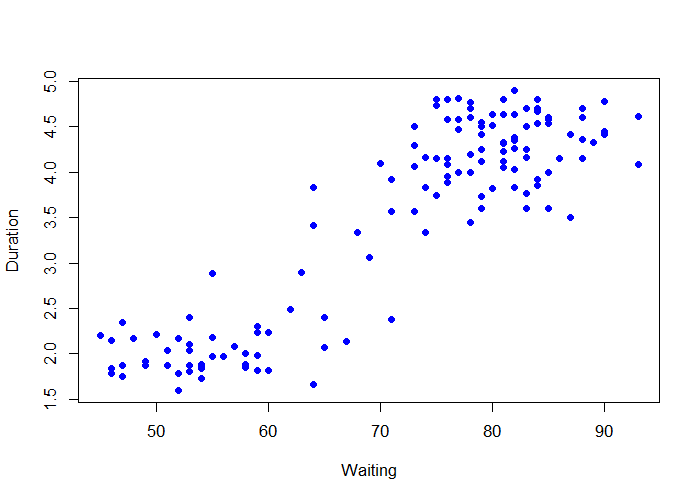
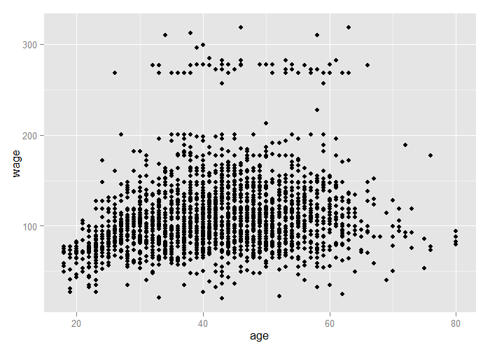
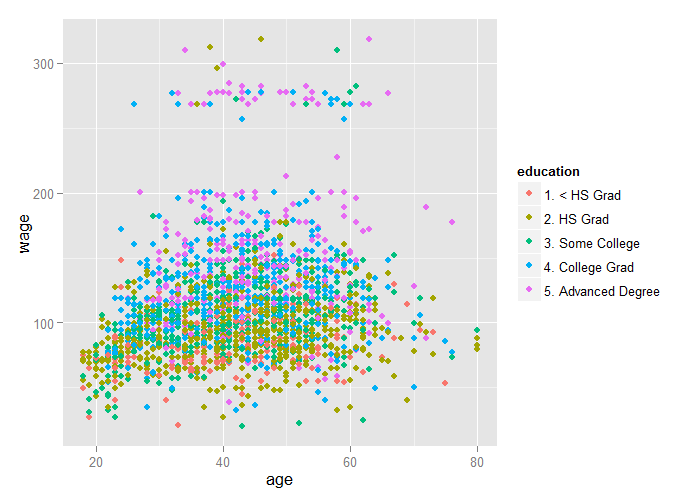

# Predicting with Regression


## Key Ideas

- Fit a simple regression model
- Plug in new covariates and multiply by the covariates
- Useful when the linear model is (nearly) correct

**Pros:**

- Easy to implement
- Easy to interpret

**Cons:**

- Often poor performance in nonlinear settings

---

## Example: Old Faithful Eruptions


Image Credit / Copyright Wally Pacholka [http://www.astropics.com/](http://www.astropics.com/)

---

## Example: Old Faithful Eruptions


```r
library(caret)
data(faithful)
set.seed(333)
inTrain <- createDataPartition(y=faithful$waiting, p=0.5, list=F)
trainFaith <- faithful[inTrain,]
testFaith <- faithful[-inTrain,]
head(trainFaith)
```

```
  eruptions waiting
1     3.600      79
3     3.333      74
5     4.533      85
6     2.883      55
7     4.700      88
8     3.600      85
```

---

## Eruption Duration Versus Waiting Time


```r
plot(trainFaith$waiting, trainFaith$eruptions, pch=19, col="blue", xlab="Waiting", ylab="Duration")
```

<div class="rimage center"></div>

---

## Fit a Linear Model

$$
ED_i = b_0 + b_1 WT_i + e_i
$$


```r
lm1 <- lm(eruptions ~ waiting, trainFaith)
summary(lm1)
```

```

Call:
lm(formula = eruptions ~ waiting, data = trainFaith)

Residuals:
     Min       1Q   Median       3Q      Max 
-1.26990 -0.34789  0.03979  0.36589  1.05020 

Coefficients:
             Estimate Std. Error t value Pr(>|t|)    
(Intercept) -1.792739   0.227869  -7.867 1.04e-12 ***
waiting      0.073901   0.003148  23.474  < 2e-16 ***
---
Signif. codes:  0 '***' 0.001 '**' 0.01 '*' 0.05 '.' 0.1 ' ' 1

Residual standard error: 0.495 on 135 degrees of freedom
Multiple R-squared:  0.8032,	Adjusted R-squared:  0.8018 
F-statistic:   551 on 1 and 135 DF,  p-value: < 2.2e-16
```

---

## Model Fit


```r
plot(trainFaith$waiting, trainFaith$eruptions, pch=19, col="blue", xlab="Waiting", ylab="Duration")
lines(trainFaith$waiting, lm1$fitted, lwd=3)
```

<div class="rimage center"></div>

---

## Predict a New Value

$$
\hat{ED} = \hat b_0 + \hat b_1 WT
$$


```r
coef(lm1)[1] + coef(lm1)[2] * 80
```

```
(Intercept) 
   4.119307 
```

```r
newdata <- data.frame(waiting=80)
predict(lm1, newdata)
```

```
       1 
4.119307 
```

---

## Plot Predictions - Training and Test


```r
par(mfrow=c(1,2))
plot(trainFaith$waiting, trainFaith$eruptions, pch=19, col="blue", xlab="Waiting", ylab="Duration")
lines(trainFaith$waiting, predict(lm1), lwd=3)
plot(testFaith$waiting, testFaith$eruptions, pch=19, col="blue", xlab="Waiting", ylab="Duration")
lines(testFaith$waiting, predict(lm1, newdata=testFaith), lwd=3)
```

<div class="rimage center"></div>

---

## Get Training Set / Test Set Errors


```r
# Calculate RMSE on training
sqrt(sum((lm1$fitted - trainFaith$eruptions)^2))
```

```
[1] 5.75186
```

```r
# Calculate RMSE on test
sqrt(sum((predict(lm1, newdata=testFaith) - testFaith$eruptions)^2))
```

```
[1] 5.838559
```

---

## Prediction Intervals


```r
pred1 <- predict(lm1, newdata=testFaith, interval="prediction")
ord <- order(testFaith$waiting)
plot(testFaith$waiting, testFaith$eruptions, pch=19, col="blue")
matlines(testFaith$waiting[ord], pred1[ord,], type="l", col=c(1,2,2), lty=c(1,1,1), lwd=3)
```

<div class="rimage center"></div>

---

## Same Process with Caret


```r
modelFit <- train(eruptions ~ waiting, trainFaith, method="lm")
summary(modelFit$finalModel)
```

```

Call:
lm(formula = .outcome ~ ., data = dat)

Residuals:
     Min       1Q   Median       3Q      Max 
-1.26990 -0.34789  0.03979  0.36589  1.05020 

Coefficients:
             Estimate Std. Error t value Pr(>|t|)    
(Intercept) -1.792739   0.227869  -7.867 1.04e-12 ***
waiting      0.073901   0.003148  23.474  < 2e-16 ***
---
Signif. codes:  0 '***' 0.001 '**' 0.01 '*' 0.05 '.' 0.1 ' ' 1

Residual standard error: 0.495 on 135 degrees of freedom
Multiple R-squared:  0.8032,	Adjusted R-squared:  0.8018 
F-statistic:   551 on 1 and 135 DF,  p-value: < 2.2e-16
```

---

## Notes and Further Reading

- Regression models with multiple covariates can be included
- Often useful in combination with other models
- [Elements of Statistical Learning](http://www-stat.stanford.edu/~tibs/ElemStatLearn/)
- [Modern applied statistics with S](http://www.amazon.com/Modern-Applied-Statistics-W-N-Venables/dp/0387954570)
- [Introduction to statistical learning](http://www-bcf.usc.edu/~gareth/ISL/)
