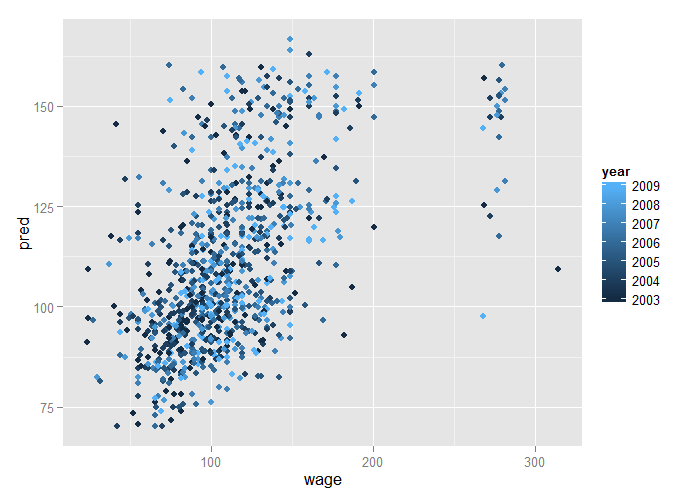

# Prediction with Multivariate Regression


## Example: Predicting Wages


Image Credit [http://www.cahs-media.org/the-high-cost-of-low-wages](http://www.cahs-media.org/the-high-cost-of-low-wages)

Data from: [ISLR package](https://cran.r-project.org/web/packages/ISLR/) from the book: [Introduction to statistical learning](http://www-bcf.usc.edu/~gareth/ISL/)

---

## Example: Wage data


```r
library(ISLR)
library(ggplot2)
library(caret)
data(Wage)
Wage <- subset(Wage, select=-c(logwage))
summary(Wage)
```

```
      year           age               sex                    maritl           race     
 Min.   :2003   Min.   :18.00   1. Male  :3000   1. Never Married: 648   1. White:2480  
 1st Qu.:2004   1st Qu.:33.75   2. Female:   0   2. Married      :2074   2. Black: 293  
 Median :2006   Median :42.00                    3. Widowed      :  19   3. Asian: 190  
 Mean   :2006   Mean   :42.41                    4. Divorced     : 204   4. Other:  37  
 3rd Qu.:2008   3rd Qu.:51.00                    5. Separated    :  55                  
 Max.   :2009   Max.   :80.00                                                           
                                                                                        
              education                     region               jobclass               health    
 1. < HS Grad      :268   2. Middle Atlantic   :3000   1. Industrial :1544   1. <=Good     : 858  
 2. HS Grad        :971   1. New England       :   0   2. Information:1456   2. >=Very Good:2142  
 3. Some College   :650   3. East North Central:   0                                              
 4. College Grad   :685   4. West North Central:   0                                              
 5. Advanced Degree:426   5. South Atlantic    :   0                                              
                          6. East South Central:   0                                              
                          (Other)              :   0                                              
  health_ins        wage       
 1. Yes:2083   Min.   : 20.09  
 2. No : 917   1st Qu.: 85.38  
               Median :104.92  
               Mean   :111.70  
               3rd Qu.:128.68  
               Max.   :318.34  
                               
```

---

## Get Training / Test Sets


```r
inTrain <- createDataPartition(y=Wage$wage, p=0.7, list=F)
training <- Wage[inTrain,]
testing <- Wage[-inTrain,]
dim(training)
```

```
[1] 2102   11
```

```r
dim(testing)
```

```
[1] 898  11
```

---

## Feature Plot


```r
featurePlot(x=training[,c("age","education","jobclass")],
            y=training$wage,
            plot="pairs")
```

<div class="rimage center"></div>

---

## Plot Age Versus Wage


```r
qplot(age, wage, data=training)
```

<div class="rimage center"></div>

---

## Plot Age Versus Wage, Color by Job Class


```r
qplot(age, wage, color=jobclass, data=training)
```

<div class="rimage center"></div>

---

## Plot Age Versus Wage, Color by Education


```r
qplot(age, wage, color=education, data=training)
```

<div class="rimage center"></div>

---

## Fit a Linear Model

$$
ED_i = b_0 + b_1 age + b_2 I(Jobclass_i = "Information") + \sum_{k=1}^4 \gamma_k I(education_i = level_k)
$$

$I(Jobclass_i = "Information")$ - binary dummy variable: 1 when `jobclass` = "Information", 0 when not equal to "Information" ("Industry", in this data)

$\sum_{k=1}^4 \gamma_k I(education_i = level_k)$ - set of 4 dummy variables (each with coefficients $\gamma_k$) for the 5 levels in the `education` factor


```r
modFit <- train(wage ~ age + jobclass + education, method="lm", data=training)
finMod <- modFit$finalModel
print(modFit)
```

```
Linear Regression 

2102 samples
  10 predictor

No pre-processing
Resampling: Bootstrapped (25 reps) 
Summary of sample sizes: 2102, 2102, 2102, 2102, 2102, 2102, ... 
Resampling results

  RMSE      Rsquared   RMSE SD  Rsquared SD
  36.47765  0.2464381  1.74351  0.02468944 

 
```

---

## Diagnostics


```r
plot(finMod, 1, pch=19, cex=0.5, col="#00000010")
```

<div class="rimage center"></div>

---

## Color by variables not used in the model

Useful when you want to explain residual variance by possible other covariates


```r
qplot(finMod$fitted, finMod$residuals, color=race, data=training)
```

<div class="rimage center"></div>

---

## Plot by Index

Whenever you can see a trend by index, it suggests that there's a variable missing from your model, or your data. Often it suggests a relationship w/ time or age or some other continuous variable.


```r
plot(finMod$residuals, pch=19)
```

<div class="rimage center"></div>

---

## Predicted Versus Truth in Test Set


```r
pred <- predict(modFit, testing)
qplot(wage, pred, color=year, data=testing)
```

<div class="rimage center"></div>

---

## If You Want to Use All Covariates


```r
modFitAll<- train(wage ~ .,data=training,method="lm")
pred <- predict(modFitAll, testing)
qplot(wage, pred, data=testing)
```

<div class="rimage center"></div>

---

## Notes and Further Reading

- Often useful in combination with other models
- [Elements of statistical learning](http://www-stat.stanford.edu/~tibs/ElemStatLearn/)
- [Modern applied statistics with S](http://www.amazon.com/Modern-Applied-Statistics-W-N-Venables/dp/0387954570)
- [Introduction to statistical learning](http://www-bcf.usc.edu/~gareth/ISL/)
