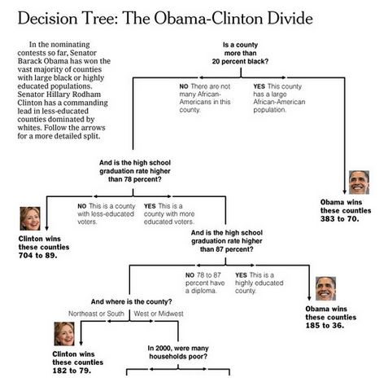

```{r setup, cache=FALSE, echo=FALSE, message=F, warning=F, tidy=FALSE}
require(knitr)
options(width=100)
opts_chunk$set(message=F, error=F, warning=F, comment=NA, fig.align='center', dpi=100, tidy=F, cache.path='.cache/', fig.path='fig/')

options(xtable.type='html')
knit_hooks$set(inline=function(x) {
    if(is.numeric(x)) {
        round(x, getOptions('digits'))
    } else {
        paste(as.character(x), collapse=', ')
    }
})
knit_hooks$set(plot=knitr:::hook_plot_html)
```

## Key Ideas

- Iteratively split variables into groups
- Evaluate "homogeneity" within each group
- Split again if necessary

**Pros:**

- Easy to interpret
- Better performance in nonlinear settings

**Cons:**

- Without pruning/cross-validation can lead to overfitting
- Harder to estimate uncertainty
- Results may be variable depending on the exact values of the variables being used

---

## Example Tree



[http://graphics8.nytimes.com/images/2008/04/16/us/0416-nat-subOBAMA.jpg](http://graphics8.nytimes.com/images/2008/04/16/us/0416-nat-subOBAMA.jpg)

---

## Basic Algorithm

1. Start with all variables in one group
2. Find the variable/split that best separates the outcomes
3. Divide the data into two groups ("leaves") on that split ("node")
4. Within each split, find the best variable/split that separates the outcomes
5. Continue until the groups are too small or sufficiently "pure"

---

## Measures of Impurity

$$
\hat p_{mk} = \frac{1}{N_m} \sum_{x_i\ in\ Leaf\ m} 1(y_i = k)
$$

**Misclassification Error:**

$$
1 - \hat p_{mk(m)};k(m) = most;common;k
$$

- 0 = perfect purity
- 0.5 = no purity

**Gini Index:**

$$
\sum_{k \ne k'} \hat p_{mk} \times \hat p_{mk'} = \sum_{k=1}^K \hat p_{mk}(1 - \hat p_{mk}) = 1 - \sum_{k=1}^K p_{mk}^2
$$

- 0 = perfect purity
- 0.5 = no purity

[http://en.wikipedia.org/wiki/Decision_tree_learning](http://en.wikipedia.org/wiki/Decision_tree_learning)

---

## Measures of Impurity

**Deviation/information gain:**

$$
-\sum_{k=1}^K \hat p_{mk}log_2\hat p_{mk}
$$

- 0 = perfect purity
- 1 = no purity

[http://en.wikipedia.org/wiki/Decision_tree_learning](http://en.wikipedia.org/wiki/Decision_tree_learning)

## Measures of Impurity

```{r leftplot, fig.height=3, fig.width=4, echo=FALSE, fig.align='center'}
par(mar=c(0,0,0,0))
set.seed(1234)
x <- rep(1:4, each=4)
y <- rep(1:4, 4)
plot(x, y, xact="n", yaxt="n", cex=3, col=c(rep("blue", 15),rep("red", 1)),
     pch=19)
```

- **Misclassification:** $1/16 = 0.06$
- **Gini:** $1 - [(1/16)^2 + (15/16)^2] = 0.12$
- **Information:** $-[1/16 \times \log_2(1/16) + 15/16 \times \log_2(15/16)] = 0.34$

```{r rightplot, dependson="leftplot", fig.height=3, fig.width=4, echo=FALSE, fig.align='center'}
par(mar=c(0,0,0,0))
plot(x, y, xaxt="n", yaxt="n", cex=3, col=c(rep("blue", 8),rep("red", 8)),
     ,pch=19)
```

- **Misclassification:** $8/16 = 0.5$
- **Gini:** $1 - [(8/16)^2 + (8/16)^2] = 0.5$
- **Information:** $-[8/16 \times \log_2(8/16) + 8/16 \times \log_2(8/16)] = 1$

---

## Example: Iris Data

```{r}
data(iris)
library(ggplot2)
library(caret)
names(iris)
table(iris$Species)
```

---

## Create training and test sets

```{r}
in.t <- createDataPartition(y=iris$Species, p=0.7, list=F)
iris.train <- iris[in.t,]
iris.test <- iris[-in.t,]
dim(iris.train)
dim(iris.test)
```

---

## Iris Pedal Widths / Sepal Width

```{r}
qplot(Petal.Width, Sepal.Width, color=Species, data=iris.train)
```

---

## Iris Petal Widths / Sepal Width

```{r}
fit <- train(Species ~ ., method="rpart", data=iris.train)
print(fit$finalModel)
```

---

## Plot Tree

```{r}
plot(fit$finalModel, uniform=T, main="Classification Tree")
text(fit$finalModel, use.n=T, all=T, cex=.8)
```

---

## Prettier Plots

```{r}
library(rattle)
fancyRpartPlot(fit$finalModel)
```

---

## Predicting New Values

```{r}
predict(fit, newdata=iris.test)
```

---

## Notes and Further Resources

- Classification trees are nonlinear models
    - They use interactions between variables
    - Data transformations may be less important (monotone transformation)
    - Trees can also be used for regression problems (continuous outcome)
- note that there are multiple tree building options in R both in the `caret` package -- [party](https://cran.r-project.org/web/packages/party/index.html), [rpart](https://cran.r-project.org/web/packages/rpart/index.html), and out of the `caret` package -- [tree](https://cran.r-project.org/web/packages/tree/index.html)
- [Introduction to Statistical Learning](http://www-bcf.usc.edu/~gareth/ISL/)
- [Elements of Statistical Learning](http://statweb.stanford.edu/~tibs/ElemStatLearn/)
- [Classification and Regression Trees](http://www.amazon.com/Classification-Regression-Trees-Leo-Breiman/dp/0412048418)