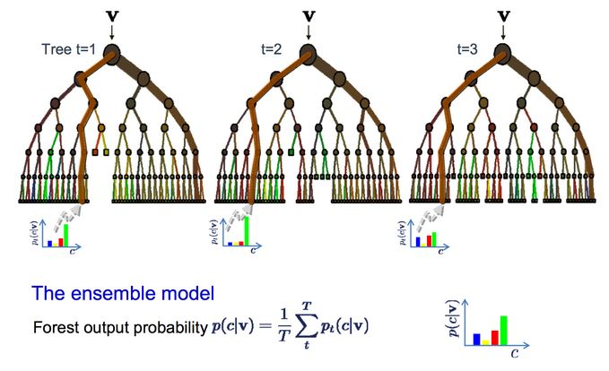

```{r setup, cache=FALSE, echo=FALSE, message=F, warning=F, tidy=FALSE}
require(knitr)
options(width=100)
opts_chunk$set(message=F, error=F, warning=F, comment=NA, fig.align='center', dpi=100, tidy=F, cache.path='.cache/', fig.path='fig/')

options(xtable.type='html')
knit_hooks$set(inline=function(x) {
    if(is.numeric(x)) {
        round(x, getOptions('digits'))
    } else {
        paste(as.character(x), collapse=', ')
    }
})
knit_hooks$set(plot=knitr:::hook_plot_html)
```

## Random Forests

1. Bootstrap samples
2. At each split, bootstrap variables
3. Grow multiple trees and vote

**Pros**

1. Accuracy

**Cons**

1. Speed
2. Interpretability
3. Overfitting

---

## Random Forests



[http://www.robots.ox.ac.uk/~az/lectures/ml/lect5.pdf](http://www.robots.ox.ac.uk/~az/lectures/ml/lect5.pdf)

---

## `iris` Data

```{r}
library(caret)
data(iris)
train.flags <- createDataPartition(y=iris$Species, p=.7, list=F)
iris.train <- iris[train.flags,]
iris.test <- iris[-train.flags,]
fit <- train(Species ~ ., iris.train, method="rf", prox=T)
fit
```

---

## Getting a Single Tree

```{r}
getTree(fit$finalModel, k=2)
```

---

## Class "Centers"

```{r}
iris.prox <- classCenter(iris.train[,c(3, 4)], iris.train$Species, fit$finalModel$prox)
iris.prox <- as.data.frame(iris.prox)
iris.prox$Species <- rownames(iris.prox)
qplot(Petal.Width, Petal.Length, col=Species, data=iris.train) +
    geom_point(aes(x=Petal.Width, y=Petal.Length, col=Species), size=5, shape=4, data=iris.prox)
```

---

## Predicting New Values

```{r}
iris.pred <- predict(fit, iris.test)
iris.test$predRight <- iris.pred == iris.test$Species
table(iris.pred, iris.test$Species)
```

---

## Predicting New Values

```{r}
qplot(Petal.Width, Petal.Length, color=predRight, data=iris.test, main="newdata Predictions")
```

---

## Notes and Further Resources

**Notes**

- Random forests are usually one of the two top performing algorithms along with boosting in prediction contests
- Random forests are difficult to interpret but often very accurate
- Care should be taken to avoid overfitting (see [rfcv](https://cran.r-project.org/web/packages/randomForest/randomForest.pdf) function)

**Further Resources**

- [Random Forests](http://www.stat.berkeley.edu/~breiman/RandomForests/cc_home.htm)
- [Random Forest Wikipedia](https://en.wikipedia.org/wiki/Random_forest)
- [Elements of Statistical Learning](http://statweb.stanford.edu/~tibs/ElemStatLearn/)