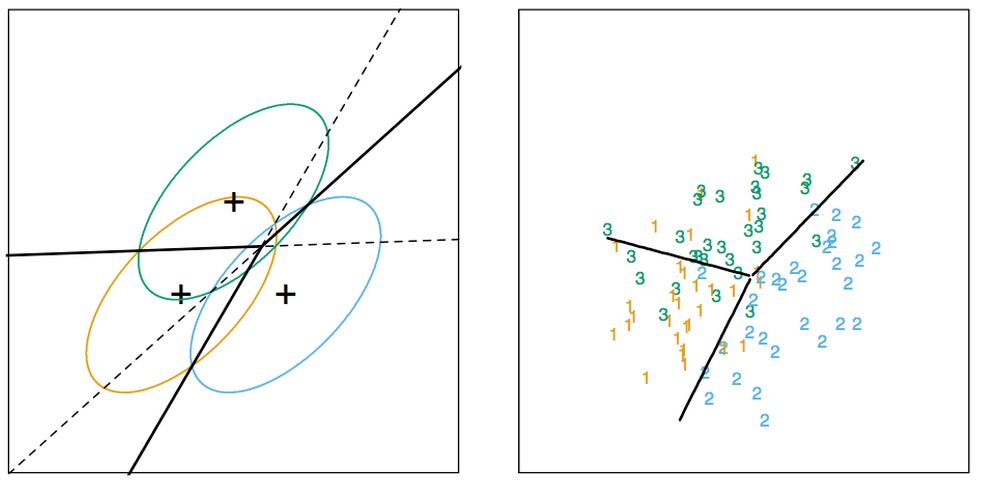

```{r setup, cache=FALSE, echo=FALSE, message=F, warning=F, tidy=FALSE}
require(knitr)
options(width=100)
opts_chunk$set(message=F, error=F, warning=F, comment=NA, fig.align='center', dpi=100, tidy=F, cache.path='.cache/', fig.path='fig/')

options(xtable.type='html')
knit_hooks$set(inline=function(x) {
    if(is.numeric(x)) {
        round(x, getOptions('digits'))
    } else {
        paste(as.character(x), collapse=', ')
    }
})
knit_hooks$set(plot=knitr:::hook_plot_html)
```

## Basic Idea

1. Assume the data follow a probablistic model
2. Use Bayes' theorem to identify optimal classifiers

**Pros**

- Can take advantage of structure of the data
- May be computationally convenient
- Are reasonably accurate on real problems

**Cons**

- Make additional assumptions about the data
- When the model is incorrect you may get reduced accuracy

---

## Model-based Approach

1. Our goal is to build parametric model for conditional distribution $P(Y = k ~|~ X = x)$
2. A typical approach is to apply [Bayes Theorem](https://en.wikipedia.org/wiki/Bayes%27_theorem)
$$
Pr(Y = k ~|~ X = x) = \frac{Pr(X = x ~|~ Y = k)Pr(Y = k)}{\sum_{\ell=1}^K Pr(X = x ~|~ Y = \ell)Pr(Y = \ell)} \\
Pr(Y = k ~|~ X = x) = \frac{f_k(x)\pi_k}{\sum_{\ell=1}^K f_\ell(x)\pi_\ell}
$$
3. Typically prior probabilities $\pi_k$ are set in advance
4. A common choice for $f_k(x) = \frac{1}{\sigma_k \sqrt{2\pi}} e^{-\frac{(x - \mu_k)^2}{\sigma_k^2}}$, a Gaussian distribution
5. Estimate the parameters $(\mu_k,\sigma_k^2)$ from the data
6. Classify to the class with the highest value of $P(Y = k ~|~ X = x)$

---

## Classifying Using the Model

A range of models use this approach

- Linear discriminant analysis assumes $f_k(x)$ is multivariate Gaussian with same covariances
- Quadratic discriminant analysis assumes $f_k(x)$ is multivariate Gaussian with different covariances
- [Model-based Prediction](http://www.stat.washington.edu/mclust/) assumes more complicated versions for the covariance matrix
- Naive Bayes assumes indpenedence between features for model building

[http://statweb.stanford.edu/~tibs/ElemStatLearn/](http://statweb.stanford.edu/~tibs/ElemStatLearn/)

---

## What Is Linear Discriminant Analysis?

$$
\log\frac{Pr(Y = k ~|~ X = x)}{Pr(Y = j ~|~ X = x)} \\
= \log\frac{f_k(x)}{f_j(x)} + \log\frac{\pi_k}{\pi_j} \\
= \log\frac{\pi_k}{\pi_j} - \frac{1}{2}(\mu_k + \mu_j)^T\sum^{-1}(\mu_k + \mu_j) \\
+ x^T\sum^{-1}(\mu_k - \mu_j)
$$

[http://statweb.stanford.edu/~tibs/ElemStatLearn/](http://statweb.stanford.edu/~tibs/ElemStatLearn/)

---

## Decision Boundaries



---

## Discrimination Function

$$\delta_k(x) = x^T\sum^{-1}\mu_k - \frac{1}{2}\mu_k\sum_{-1}\mu_k + \log(\mu_k)$$

- Decide on class based on $\hat Y(x) \ argmax_k\delta_k(x)$
- We usually estimate parameters with maximum likelihood

---

## Naive Bayes

Suppose we have many predictors, we would want to model $P(Y = k ~|~ X_1,...,X_m)$

We could use Bayes Theorem to get

$$
P(Y = k ~|~ X_1,...X_m) = \frac{\pi_k P(X_1,...,X_m ~|~ Y = k)}{\sum_{\ell=1}^K P(X_1,...,X_m ~|~ Y = k) \pi_\ell} \\
\propto \pi_k P(X_1,...,X_m ~|~ Y = k)
$$

This can be written

$$
P(X_1,...,X_m,Y = k) = \pi_k P(X_1 ~|~ Y = k) P(X_2,...,X_m ~|~ X_1, Y = k) \\
= \pi_k P(X1 ~|~ Y = k) P(X_2 ~|~ X_1, Y = k) P(X_3,...,X_m ~|~ X_1,X_2,Y = k) \\
= \pi_k P(X_1 ~|~ Y = k) P(X_2 ~|~ X_1,Y = k)...P(X_m ~|~ X_1,...,X_{m-1},Y = k)
$$

We could make an assumption to write this

$$\approx \pi_k P(X_1 ~|~ Y = k) P(X_2 ~|~ Y = k)...P(X_m ~|~ Y = k)$$

---

## Example: `iris` Data

```{r}
library(caret)
data(iris)
names(iris)
table(iris$Species)
```

## Create Training and Test Sets

```{r}
train.flags <- createDataPartition(y=iris$Species, p=.7, list=F)
iris.train <- iris[train.flags,]
iris.test <- iris[-train.flags,]
dim(iris.train)
dim(iris.test)
```

---

## Build Predictors

```{r}
fit.lda <- train(Species ~ ., iris.train, method="lda")
fit.nb <- train(Species ~ ., iris.train, method="nb")
p.lda <- predict(fit.lda, iris.test)
p.nb <- predict(fit.nb, iris.test)
table(p.lda, p.nb)
```

---

## Comparison of Results

```{r}
p.compare <- p.lda == p.nb
qplot(Petal.Width, Sepal.Width, color=p.compare, data=iris.test)
```

---

## Notes and Further Reading

- [Introduction to Statistical Learning](http://www-bcf.usc.edu/~gareth/ISL/)
- [Elements of Statistical Learning](http://statweb.stanford.edu/~tibs/ElemStatLearn/)
- [Model-based Clustering](http://www.stat.washington.edu/raftery/Research/PDF/fraley2002.pdf)
- [Linear Disriminant Analysis](https://en.wikipedia.org/wiki/Linear_discriminant_analysis)
- [Quadratic Discriminant Analysis](https://en.wikipedia.org/wiki/Quadratic_classifier)