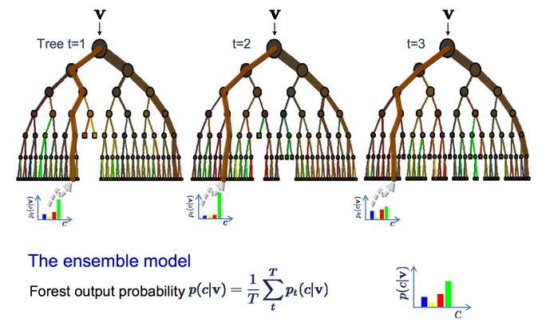
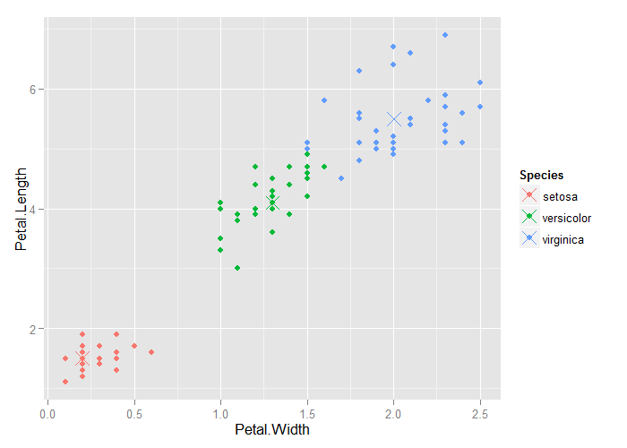
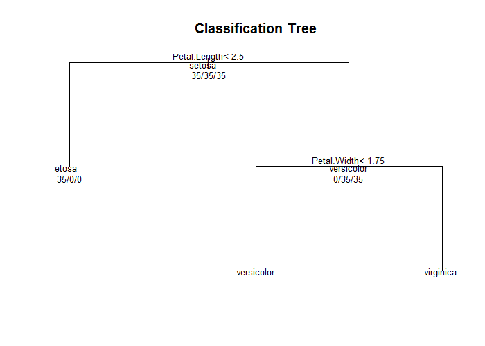

# Random Forests


## Random Forests

1. Bootstrap samples
2. At each split, bootstrap variables
3. Grow multiple trees and vote

**Pros**

1. Accuracy

**Cons**

1. Speed
2. Interpretability
3. Overfitting

---

## Random Forests



[http://www.robots.ox.ac.uk/~az/lectures/ml/lect5.pdf](http://www.robots.ox.ac.uk/~az/lectures/ml/lect5.pdf)

---

## `iris` Data


```r
library(caret)
data(iris)
train.flags <- createDataPartition(y=iris$Species, p=.7, list=F)
iris.train <- iris[train.flags,]
iris.test <- iris[-train.flags,]
fit <- train(Species ~ ., iris.train, method="rf", prox=T)
fit
```

```
Random Forest 

105 samples
  4 predictor
  3 classes: 'setosa', 'versicolor', 'virginica' 

No pre-processing
Resampling: Bootstrapped (25 reps) 
Summary of sample sizes: 105, 105, 105, 105, 105, 105, ... 
Resampling results across tuning parameters:

  mtry  Accuracy   Kappa      Accuracy SD  Kappa SD  
  2     0.9656672  0.9478199  0.02948507   0.04452231
  3     0.9680102  0.9513064  0.02869160   0.04342408
  4     0.9668991  0.9496320  0.02792887   0.04225969

Accuracy was used to select the optimal model using  the largest value.
The final value used for the model was mtry = 3. 
```

---

## Getting a Single Tree


```r
getTree(fit$finalModel, k=2)
```

```
  left daughter right daughter split var split point status prediction
1             2              3         4        1.45      1          0
2             4              5         3        2.60      1          0
3             0              0         0        0.00     -1          3
4             0              0         0        0.00     -1          1
5             0              0         0        0.00     -1          2
```

---

## Class "Centers"


```r
iris.prox <- classCenter(iris.train[,c(3, 4)], iris.train$Species, fit$finalModel$prox)
iris.prox <- as.data.frame(iris.prox)
iris.prox$Species <- rownames(iris.prox)
qplot(Petal.Width, Petal.Length, col=Species, data=iris.train) +
    geom_point(aes(x=Petal.Width, y=Petal.Length, col=Species), size=5, shape=4, data=iris.prox)
```

<div class="rimage center"></div>

---

## Predicting New Values


```r
iris.pred <- predict(fit, iris.test)
iris.test$predRight <- iris.pred == iris.test$Species
table(iris.pred, iris.test$Species)
```

```
            
iris.pred    setosa versicolor virginica
  setosa         15          0         0
  versicolor      0         12         0
  virginica       0          3        15
```

---

## Predicting New Values


```r
qplot(Petal.Width, Petal.Length, color=predRight, data=iris.test, main="newdata Predictions")
```

<div class="rimage center"></div>

---

## Notes and Further Resources

**Notes**

- Random forests are usually one of the two top performing algorithms along with boosting in prediction contests
- Random forests are difficult to interpret but often very accurate
- Care should be taken to avoid overfitting (see [rfcv](https://cran.r-project.org/web/packages/randomForest/randomForest.pdf) function)

**Further Resources**

- [Random Forests](http://www.stat.berkeley.edu/~breiman/RandomForests/cc_home.htm)
- [Random Forest Wikipedia](https://en.wikipedia.org/wiki/Random_forest)
- [Elements of Statistical Learning](http://statweb.stanford.edu/~tibs/ElemStatLearn/)
