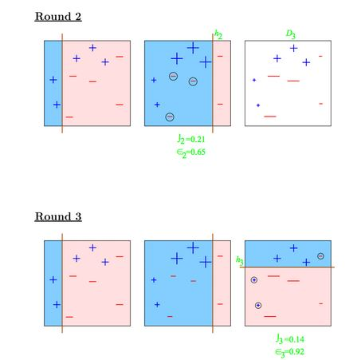
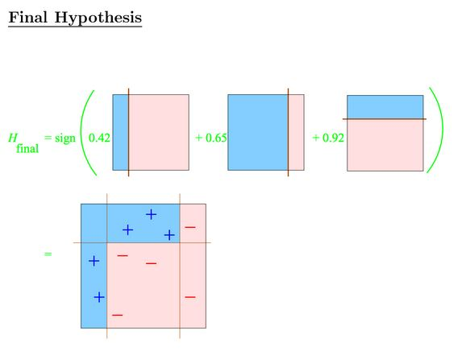
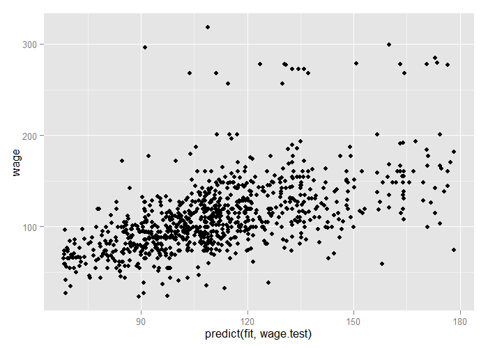

# Boosting


## Basic Idea

1. Take lots of (possibly) weak predictors
2. Weight them and add them up
3. Get a stronger predictor

---

## Basic Idea Behind Boosting

1. Start with a set of classifiers $h_1,...,h_k$
    - Examples: All possible trees, all possible regression models, all possible cutoffs
2. Create a classifier that combines classification functions: $f(x) = \mbox{sgn}\left(\sum_{t=1}^T \alpha_t h_t(x)\right)$
    - Goal is to minimize error (on training set)
    - Iterative, select one $h$ at each step
    - Calculate weights based on errors
    - Upweight missed classifications and select next $h$

[Adaboost on Wikipedia](https://en.wikipedia.org/wiki/AdaBoost)

[http://webee.technion.ac.il/people/rmeir/BoostingTutorial.pdf](http://webee.technion.ac.il/people/rmeir/BoostingTutorial.pdf)

---

## Simple Example


[http://webee.technion.ac.il/people/rmeir/BoostingTutorial.pdf](http://webee.technion.ac.il/people/rmeir/BoostingTutorial.pdf)

---

## Round 1: adaboost


[http://webee.technion.ac.il/people/rmeir/BoostingTutorial.pdf](http://webee.technion.ac.il/people/rmeir/BoostingTutorial.pdf)

---

## Round 2 & 3



[http://webee.technion.ac.il/people/rmeir/BoostingTutorial.pdf](http://webee.technion.ac.il/people/rmeir/BoostingTutorial.pdf)

---

## Completed Classifier



[http://webee.technion.ac.il/people/rmeir/BoostingTutorial.pdf](http://webee.technion.ac.il/people/rmeir/BoostingTutorial.pdf)

---

## Boosting in R

- Boosting can be used with any subset of classifiers
- One large subclass is [gradient boosting](https://en.wikipedia.org/wiki/Gradient_boosting)
- R has multiple boosting libraries. Differences include the choice of basic classification functions and combination rules
    - [gbm](https://cran.r-project.org/web/packages/gbm/index.html) -- boosting with trees
    - [mboost](https://cran.r-project.org/web/packages/mboost/index.html) -- model-based boosting
    - [ada](https://cran.r-project.org/web/packages/ada/index.html) -- statistical boosting based on [additive logistic regression](http://projecteuclid.org/DPubS?service=UI&version=1.0&verb=Display&handle=euclid.aos/1016218223)
    - [gamBoost](https://cran.r-project.org/web/packages/GAMBoost/index.html) -- for boosting generalized additive models
- Most of these are available in the `caret` package

---

## Wage Example -- Fit the Model


```r
library(caret)
library(ISLR)
data(Wage)
wage <- subset(Wage, select=-(logwage))
train.flags <- createDataPartition(y=wage$wage, p=.7, list=F)
wage.train <- wage[train.flags,]
wage.test <- wage[-train.flags,]
fit <- train(wage ~ ., wage.train, method="gbm", verbose=F)
print(fit)
```

```
Stochastic Gradient Boosting 

2102 samples
  10 predictor

No pre-processing
Resampling: Bootstrapped (25 reps) 
Summary of sample sizes: 2102, 2102, 2102, 2102, 2102, 2102, ... 
Resampling results across tuning parameters:

  interaction.depth  n.trees  RMSE      Rsquared   RMSE SD   Rsquared SD
  1                   50      34.84827  0.3304820  1.431030  0.02083939 
  1                  100      34.26901  0.3402003  1.445132  0.02131351 
  1                  150      34.22521  0.3400500  1.456494  0.02118784 
  2                   50      34.29966  0.3399542  1.411279  0.02210904 
  2                  100      34.21606  0.3400124  1.380018  0.01948192 
  2                  150      34.28778  0.3377149  1.374647  0.01955689 
  3                   50      34.18782  0.3421014  1.420617  0.02156606 
  3                  100      34.35111  0.3356683  1.372969  0.02199806 
  3                  150      34.57259  0.3290158  1.364180  0.02155443 

Tuning parameter 'shrinkage' was held constant at a value of 0.1
Tuning parameter
 'n.minobsinnode' was held constant at a value of 10
RMSE was used to select the optimal model using  the smallest value.
The final values used for the model were n.trees = 50, interaction.depth = 3, shrinkage = 0.1
 and n.minobsinnode = 10. 
```

---

## Plot the Results


```r
qplot(predict(fit, wage.test), wage, data=wage.test)
```

<div class="rimage center"></div>

---

## Notes and Further Reading

- A couple of nice tutorials for boosting
    - Freund and Shapire -- [http://www.cc.gatech.edu/~thad/6601-gradAI-fall2013/boosting.pdf](http://www.cc.gatech.edu/~thad/6601-gradAI-fall2013/boosting.pdf)
    - Ron Meir -- [http://webee.technion.ac.il/people/rmeir/BoostingTutorial.pdf](http://webee.technion.ac.il/people/rmeir/BoostingTutorial.pdf
- Boosting, random forests, and model ensembling are the most common tools that win Kaggle and other prediction contests
    - [http://www.netflixprize.com/assets/GrandPrize2009_BPC_BigChaos.pdf](http://www.netflixprize.com/assets/GrandPrize2009_BPC_BigChaos.pdf)
    - [https://kaggle2.blob.core.windows.net/wiki-files/327/09ccf652-8c1c-4a3d-b979-ce2369c985e4/Willem%20Mestrom%20-%20Milestone%201%20Description%20V2%202.pdf](https://kaggle2.blob.core.windows.net/wiki-files/327/09ccf652-8c1c-4a3d-b979-ce2369c985e4/Willem%20Mestrom%20-%20Milestone%201%20Description%20V2%202.pdf)
