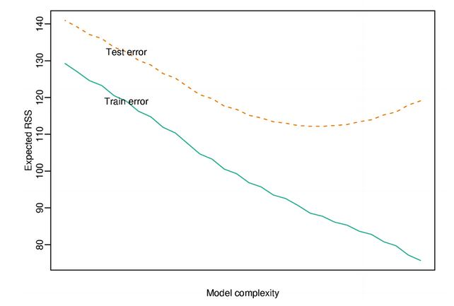

```{r setup, cache=FALSE, echo=FALSE, message=F, warning=F, tidy=FALSE}
require(knitr)
options(width=100)
opts_chunk$set(message=F, error=F, warning=F, comment=NA, fig.align='center', dpi=100, tidy=F, cache.path='.cache/', fig.path='fig/')

options(xtable.type='html')
knit_hooks$set(inline=function(x) {
    if(is.numeric(x)) {
        round(x, getOptions('digits'))
    } else {
        paste(as.character(x), collapse=', ')
    }
})
knit_hooks$set(plot=knitr:::hook_plot_html)
```

## Basic Idea

1. Fit a regression model
2. Penalize (or shrink) large coefficients

**Pros:**

- Can help with the bias/variance tradeoff
- Can help with model selection

**Cons:**

- May be computationally demanding on large datasets
- Does not perform as well as random forests and boosting

---

## A Motivating Example

$$Y = \beta_0 + \beta_1 X_1 + \beta_2 X_2 + \epsilon$$

where $X_1$ and $X_2$ are nearly perfectly correlated (co-linear). You can approximate this model by:

$$Y = \beta_0 + (\beta_1 + \beta_2) X_1 + \epsilon$$

The result is:

- You will get a good estimate of $Y$
- The estimate (of Y) will be biased
- We may reduce variance in the estimate

---

## Prostate Cancer

```{r}
library(ElemStatLearn)
data(prostate)
str(prostate)
```

---

## Subset Selection


[Code here](http://www.cbcb.umd.edu/~hcorrada/PracticalML/src/selection.R)

---

## Most Common Pattern



[http://www.biostat.jhsph.edu/~ririzarr/Teaching/649/](http://www.biostat.jhsph.edu/~ririzarr/Teaching/649/)

---

## Model Selection Approach: Split Samples

- No method better when data/computation time permits
- Approach:
    1. Divide data into training/test/validation
    2. Treat validation as test data, train all competing models on the train data and pick the best one on validation
    3. To appropriately assess performance on new data apply to test set
    4. You may re-split and reperform steps 1-3
- Two common problems:
    - Limited data
    - Computational complexity

[http://www.biostat.jhsph.edu/~ririzarr/Teaching/649/](http://www.biostat.jhsph.edu/~ririzarr/Teaching/649/)

[http://www.cbcb.umd.edu/~hcorrada/PracticalML/](http://www.cbcb.umd.edu/~hcorrada/PracticalML/)

---

## Decomposing Expected Prediction Error

Assume $Y_i = f(X_i) + \epsilon_i$

$EPE(\lambda) = E\left[{Y - \hat f_\lambda (X)}^2\right]$

Suppose $\hat f_\lambda$ is the estimate from the training data and look at a new data point $X = x*$

$$
E\left[{Y - \hat f_\lambda (x*)}^2\right] = \sigma^2 + {E[\hat f_\lambda (x*)] - f(x*)}^2 + var[\hat f_\lambda(x_0)] \\
= \mbox{Irreducible error + Bias}^2 \ \mbox{+ Variance}
$$

[http://www.biostat.jhsph.edu/~ririzarr/Teaching/649/](http://www.biostat.jhsph.edu/~ririzarr/Teaching/649/)

[http://www.cbcb.umd.edu/~hcorrada/PracticalML/](http://www.cbcb.umd.edu/~hcorrada/PracticalML/)

---

## Another Issue for High-Dimensional Data

```{r}
small = prostate[1:5,]
lm(lpsa ~ ., data=small)
```

[http://www.biostat.jhsph.edu/~ririzarr/Teaching/649/](http://www.biostat.jhsph.edu/~ririzarr/Teaching/649/)

[http://www.cbcb.umd.edu/~hcorrada/PracticalML/](http://www.cbcb.umd.edu/~hcorrada/PracticalML/)

---

## Hard Thresholding

- Model $Y = f(X) + \epsilon$
- Set $\hat f_\lambda(x) = x'\beta$
- Constrain only $\lambda$ coeffficients to be non-zero
- Selection problem is after chosing $\lambda$ figure out which $p - \lambda$ coefficients to make non-zero

[http://www.biostat.jhsph.edu/~ririzarr/Teaching/649/](http://www.biostat.jhsph.edu/~ririzarr/Teaching/649/)

[http://www.cbcb.umd.edu/~hcorrada/PracticalML/](http://www.cbcb.umd.edu/~hcorrada/PracticalML/)

---

## Regularization for Regression

If the $\beta_j$'s are unconstrained:

- They can explode
- And hence are susceptible to very high variance

To control variance, we might regularize/shrink the coefficients

$$PSRR(\beta) = \sum_{j=1}^n(Y_j - \sum_{i=1}^m\beta_{1i}X_{ij})^2 + P(\lambda;\beta)$$

where _PRSS_ is a penalized form of the sum of squares. Things that are commonly looked for

- Penalty reduces complexity
- Penalty reduces variance
- Penalty respects structure of the problem

---

## Ridge Regression

Solve:

$$\sum_{i=1}^N\left(y_i - \beta_0 + \sum_{j=1}^p x_{ij}\beta_j\right)^2 + \lambda \sum_{j=1}^p \beta_j^2$$

equivalent to solving

$\sum_{i=1}^N \left(y_i - \beta_0 + \sum_{j=1}^p x_{ij}\beta_j\right)^2$ subject to $\sum_{j=1}^p \beta_j^2 \le s$ where $s$ is inversely proportional to $\lambda$

Inclusion of $\lambda$ makes the problem non-singular even if $X^T X$ is not invertible

[http://www.biostat.jhsph.edu/~ririzarr/Teaching/649/](http://www.biostat.jhsph.edu/~ririzarr/Teaching/649/)

[http://www.cbcb.umd.edu/~hcorrada/PracticalML/](http://www.cbcb.umd.edu/~hcorrada/PracticalML/)

---

## Ridge Coefficient Paths


[http://www.biostat.jhsph.edu/~ririzarr/Teaching/649/](http://www.biostat.jhsph.edu/~ririzarr/Teaching/649/)

[http://www.cbcb.umd.edu/~hcorrada/PracticalML/](http://www.cbcb.umd.edu/~hcorrada/PracticalML/)

---

## Tuning Parameter $\lambda$

- $\lambda$ controls the size of the coefficients
- $\lambda$ controls the about of {bf regularization}
- As $\lambda \rightarrow 0$ we obtain the least square solution
- As $\lambda \rightarrow \infty$ we have $\hat \beta_{\lambda=\infty}^{ridge} = 0$

---

## Lasso

$\sum_{i=1}^N \left(y_i - \beta_0 + \sum_{j=1}^p x_{ij} \beta_j\right)^2$ subject to $\sum_{j=1}^p |\beta_j| \le s$

also has a lagrangian form

$$\sum_{i=1}^N\left(y_i - \beta_0 + \sum_{j=1}^p x_{ij}\beta_j\right)^2 + \lambda\sum_{j=1}^p |\beta_j|$$

For orthonormal design matrices (not the norm!) this has a closed form solutions

$$\hat \beta_j = sign(\hat \beta_j^0)(|\hat \beta_j^0| - \gamma)^+$$

but not in general.

[http://www.biostat.jhsph.edu/~ririzarr/Teaching/649/](http://www.biostat.jhsph.edu/~ririzarr/Teaching/649/)

[http://www.cbcb.umd.edu/~hcorrada/PracticalML/](http://www.cbcb.umd.edu/~hcorrada/PracticalML/)

---

## Notes and Further Reading

- [Hector Corrado Bravo's Practical Machine Learning lecture notes](http://www.cbcb.umd.edu/~hcorrada/PracticalML/)
- [Hector's penalized regression reading list](http://www.cbcb.umd.edu/~hcorrada/AMSC689.html#readings)
- [Elements of Statistical Learning](http://statweb.stanford.edu/~tibs/ElemStatLearn/)
- In `caret` methods are:
    - `ridge`
    - `lasso`
    - `relaxo`