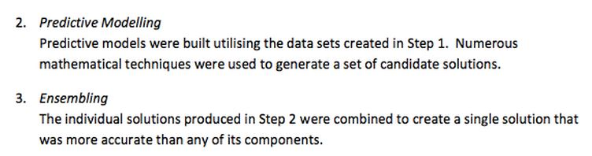
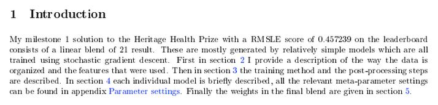
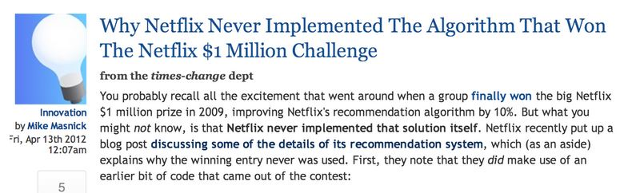

```{r setup, cache=FALSE, echo=FALSE, message=F, warning=F, tidy=FALSE}
require(knitr)
options(width=100)
opts_chunk$set(message=F, error=F, warning=F, comment=NA, fig.align='center', dpi=100, tidy=F, cache.path='.cache/', fig.path='fig/')

options(xtable.type='html')
knit_hooks$set(inline=function(x) {
    if(is.numeric(x)) {
        round(x, getOptions('digits'))
    } else {
        paste(as.character(x), collapse=', ')
    }
})
knit_hooks$set(plot=knitr:::hook_plot_html)
```

## Key Ideas

- You can combine classifiers by averaging/voting
- Combining classifiers improves accuracy
- Combining classifiers reduces interpretability
- Boosting, bagging, and random forests are variants on this theme

---

## Netflix Prize

BellKor = Combination of 107 predictors


[http://www.netflixprize.com//leaderboard](http://www.netflixprize.com//leaderboard)

---

## Heritage Health Prize - Progress Prize 1



[Market Makers](https://kaggle2.blob.core.windows.net/wiki-files/327/e4cd1d25-eca9-49ca-9593-b254a773fe03/Market%20Makers%20-%20Milestone%201%20Description%20V2%201.pdf)



[Mestrom](https://kaggle2.blob.core.windows.net/wiki-files/327/09ccf652-8c1c-4a3d-b979-ce2369c985e4/Willem%20Mestrom%20-%20Milestone%201%20Description%20V2%202.pdf)

---

## Basic Intuition -- Majority Vote

Suppose we have 5 completely independent classifiers

If accuracy is 70% for each:

- $10 \times (0.7)^3(0.3)^2 + 5 \times (0.7)^4(0.3)^2 + (0.7)^5$
- 83.7% majority vote accuracy

With 101 independent classifiers

- 99.9% majority vote accuracy

---

## Approaches for Combining Classifiers

1. Bagging, boosting, random forests
    - Usually combine similar classifiers
2. Combining different classifiers
    - Model stacking
    - Model ensembling

--

## Example with `Wage` data

**Create training, test, and validation sets**

```{r}
library(ISLR)
data(Wage)
library(ggplot2)
library(caret)
Wage <- subset(Wage, select=-c(logwage))

# Create a building dataset and validation set
inBuild <- createDataPartition(y=Wage$wage,
                               p=0.7, list=F)
validation <- Wage[-inBuild,]
buildData <- Wage[inBuild,]

inTrain <- createDataPartition(y=buildData$wage,
                               p=0.7, list=F)
training <- buildData[inTrain,]
testing <- buildData[-inTrain,]
```

---

## `Wage` datasets

**Create training, test, and validation sets**

```{r}
dim(training)
dim(testing)
dim(validation)
```

---

## Build Two Different Models

```{r model, cache=TRUE}
mod1 <- train(wage ~ ., training, method="glm")
mod2 <- train(wage ~ ., training, method="rf",
              trControl=trainControl(method="cv"), number=3)
```

---

## Predict on the Testing Set

```{r predict1, cache=TRUE}
pred1 <- predict(mod1, testing)
pred2 <- predict(mod2, testing)
qplot(pred1, pred2, color=wage, data=testing)
```

---

## Fit a Model that Combines Predictors

```{r model2, cache=TRUE}
predDF <- data.frame(pred1, pred2, wage=testing$wage)
combModFit <- train(wage ~ ., predDF, method="gam")
combPred <- predict(combModFit, predDF)
```

---

## Testing Errors

```{r}
sqrt(sum((pred1 - testing$wage)^2))
sqrt(sum((pred2 - testing$wage)^2))
sqrt(sum((combPred - testing$wage)^2))
```

---

## Predict on Validation Dataset

```{r predict2, cache=TRUE}
pred1V <- predict(mod1, validation)
pred2V <- predict(mod2, validation)
predVDF <- data.frame(pred1=pred1V, pred2=pred2V)
combPredV <- predict(combModFit, predVDF)
```

---

## Evaluate on Validation

```{r}
sqrt(sum((pred1V - validation$wage)^2))
sqrt(sum((pred2V - validation$wage)^2))
sqrt(sum((combPredV - validation$wage)^2))
```

---

## Notes and Further Resources

- Even simple blending can be useful
- Typical model for binary/multiclass data
    - Build an odd number of models
    - Predict with each model
    - Predict the class by majority vote
- This can get dramatically more complicated
    - Simple blending in `caret`: [caretEnsemble](https://github.com/zachmayer/caretEnsemble) (use at your own risk!)
    - Wikipedia [ensemble learning](https://en.wikipedia.org/wiki/Ensemble_learning)
    
---

## Recall - Scalability Matters



[http://www.techdirt.com/blog/innovation/articles/20120409/03412518422/](http://www.techdirt.com/blog/innovation/articles/20120409/03412518422/)

[http://techblog.netflix.com/2012/04/netflix-recommendations-beyond-5-stars.html](http://techblog.netflix.com/2012/04/netflix-recommendations-beyond-5-stars.html) 