# Forecasting


## Time Series Data

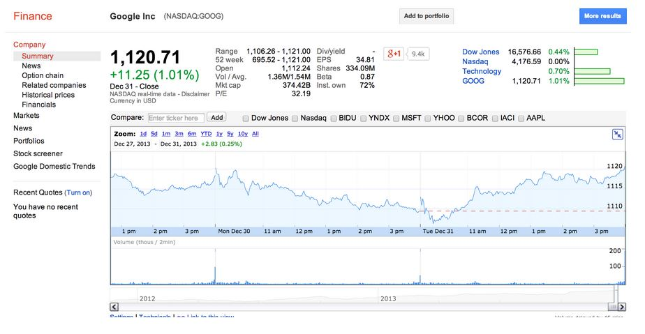

[https://www.google.com/finance](https://www.google.com/finance)

---

## What Is Different?

- Data are dependent over time
- Specific pattern types
    - Trends -- long-term increase or decrease
    - Seasonal patterns -- patterns related to time of week, month, etc.
    - Cycles -- patterns that rise and fall periodically
- Subsampling into training/test is more complicated
- Similar issues arise in spatial data
    - Dependency between nearby observations
    - Location-specific effects
- Typically goal is to predict one or more observations in the future
- All standard predictions can be used (with caution!)

---

## Beware Spurious Correlations

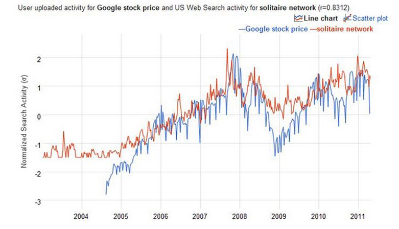

[http://www.google.com/trends/correlate](http://www.google.com/trends/correlate)

[http://www.newscientist.com/blogs/onepercent/2011/05/google-correlate-passes-our-we.html](http://www.newscientist.com/blogs/onepercent/2011/05/google-correlate-passes-our-we.html)

---

## Also Common in Geographic Analyses

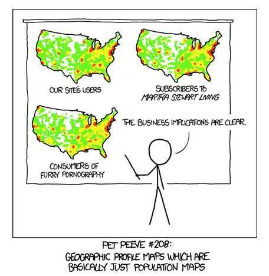

[http://xkcd.com/1138/](http://xkcd.com/1138/)

---

## Beware Extrapolation!

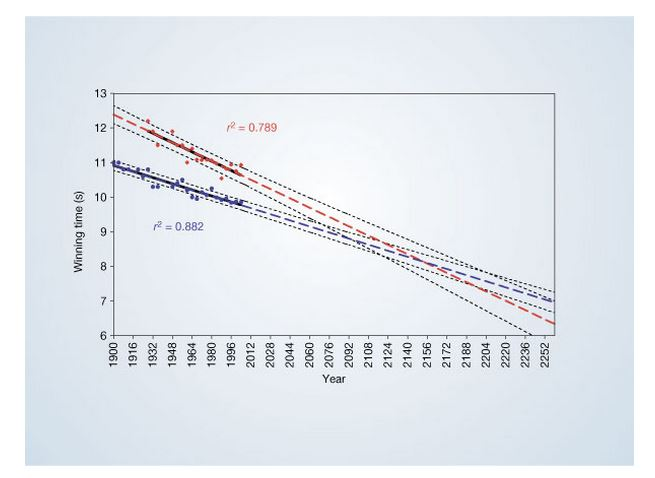

[http://www.nature.com/nature/journal/v431/n7008/full/431525a.html](http://www.nature.com/nature/journal/v431/n7008/full/431525a.html)

---

## Google Data


```r
library(quantmod)
from.dat <- as.Date("01/01/08", format="%m/%d/%y")
to.dat <- as.Date("12/31/13", format="%m/%d/%y")
getSymbols("GOOG", src="google", from=from.dat, to=to.dat)
```

```
[1] "GOOG"
```

```r
head(GOOG)
```

```
           GOOG.Open GOOG.High GOOG.Low GOOG.Close GOOG.Volume
2008-01-02    346.09    348.34   338.53     342.25          NA
2008-01-03    342.29    343.08   337.92     342.32          NA
2008-01-04    339.51    340.14   327.17     328.17          NA
2008-01-07    326.64    330.81   318.36     324.30          NA
2008-01-08    326.17    329.65   315.18     315.52          NA
2008-01-09    314.70    326.34   310.94     326.27          NA
```

---

## Summarize Monthly and Store as Time Series


```r
mGoog <- to.monthly(GOOG)
googOpen <- Op(mGoog)
ts1 <- ts(googOpen,frequency=12)
plot(ts1,xlab="Years+1", ylab="GOOG")
```

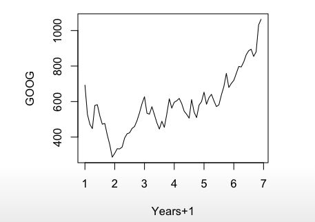

---

## Example Time Series Documentation

- **Trend** -- Consistently increasing pattern over time
- **Seasonal** -- When there is a pattern over a fixed period of time that recurs
- **Cyclic** -- When data rises and falls over non-fixed periods

[https://www.otexts.org/fpp/6/1](https://www.otexts.org/fpp/6/1)

---

## Decompose a Time Series into Parts


```r
plot(decompose(ts1),xlab="Years+1")
```

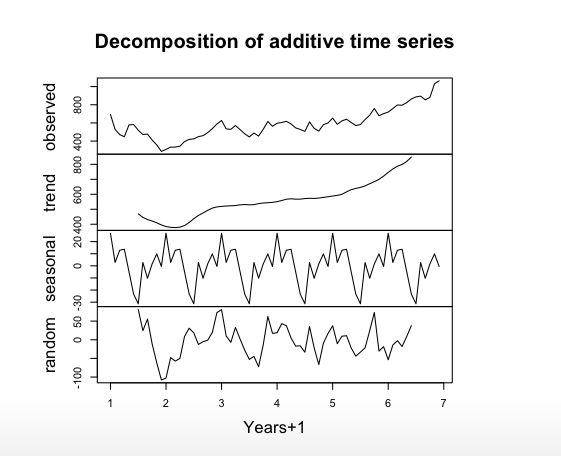

---

## Training and Test Sets


```r
ts1Train <- window(ts1,start=1,end=5)
ts1Test <- window(ts1,start=5,end=(7-0.01))
ts1Train
```

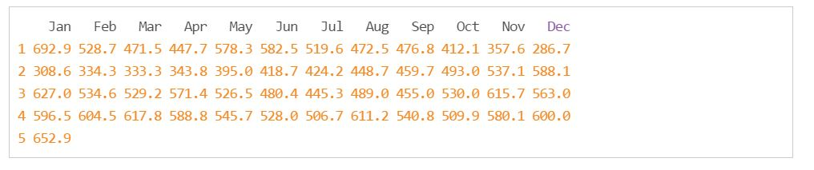

---

## Simple Moving Average

$$Y_t = \frac{1}{2 \times k + 1}\sum_{j=-k}^k y_{t + j}$$


```r
plot(ts1Train)
lines(ma(ts1Train,order=3),col="red")
```

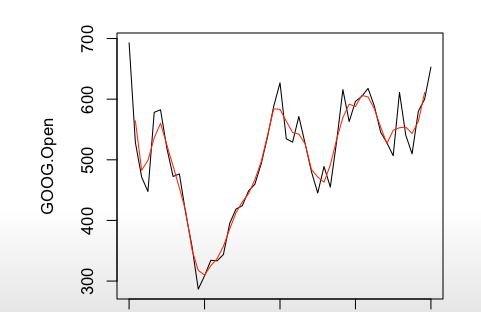

---

## Exponential Smoothing

**Example -- simple exponential smoothing**

$$\hat y_{t+1} = \alpha y_t + (1 - \alpha) \hat y_{t-1}$$

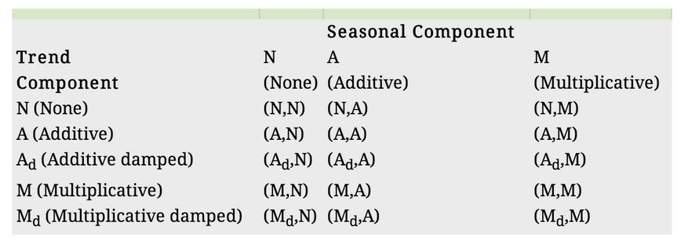

[https://www.otexts.org/fpp/7/6](https://www.otexts.org/fpp/7/6)

---

## Exponential Smoothing


```r
ets1 <- ets(ts1Train,model="MMM")
fcast <- forecast(ets1)
plot(fcast); lines(ts1Test,col="red")
```

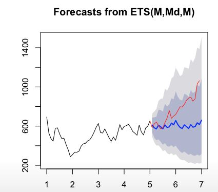

---

## Get the Accuracy


```r
accuracy(fcast, ts1Test)
```

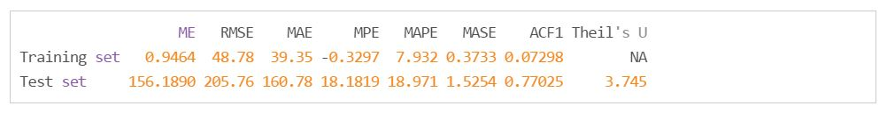

---

## Notes and Further Resources

- [Forecasting and timeseries prediction](https://en.wikipedia.org/wiki/Forecasting) is an entire field of study
- Rob Hyndman's [Forecasting: principle and practice](https://www.otexts.org/fpp/) is a good place to start
- Cautions:
    - Be wary of spurious correlations
    - Be careful how far you predict (extrapolation)
    - Be wary of dependencies over time
- See [quantmod](https://cran.r-project.org/web/packages/quantmod/quantmod.pdf) or [quandl](https://www.quandl.com/help/packages/r) packages for finance-related problems
