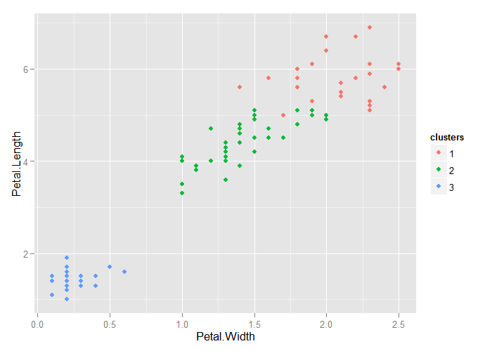

# Unsupervised Prediction


## Key Ideas

- Sometimes you don't know the labels for prediction
- To build a predictor
    - Create clusters
    - Name clusters
    - Build predictor for clusters
- In a new dataset
    - Predict clusters
    
---

## `iris` Example Ignoring Species Labels


```r
data(iris)
library(ggplot2)
library(caret)
train.flags <- createDataPartition(y=iris$Species, p=0.7, list=F)
iris.train <- iris[train.flags,]
iris.test <- iris[-train.flags,]
dim(iris.train)
```

```
[1] 105   5
```

```r
dim(iris.test)
```

```
[1] 45  5
```

---

## Cluster with k-means


```r
k.means1 <- kmeans(subset(iris.train, select=-c(Species)), centers=3)
iris.train$clusters <- as.factor(k.means1$cluster)
qplot(Petal.Width, Petal.Length, color=clusters, data=iris.train)
```

<div class="rimage center"></div>

---

## Compare to real labels


```r
table(k.means1$cluster, iris.train$Species)
```

```
   
    setosa versicolor virginica
  1      0          2        24
  2      0         33        11
  3     35          0         0
```

---

## Build Predictor


```r
fit <- train(clusters ~ ., data=subset(iris.train, select=-c(Species)), method="rpart")
table(predict(fit, iris.train), iris.train$Species)
```

```
   
    setosa versicolor virginica
  1      0          0        23
  2      0         35        12
  3     35          0         0
```

---

## Apply on Test


```r
test.cluster.pred <- predict(fit, iris.test)
table(test.cluster.pred, iris.test$Species)
```

```
                 
test.cluster.pred setosa versicolor virginica
                1      0          0        11
                2      0         15         4
                3     15          0         0
```

---

## Notes and Further Reading

- The `cl_predict` function in the `clue` package provides similar functionality
- Beware over-interpretation of clusters!
- This is one basic approach to [recommendation engines](https://en.wikipedia.org/wiki/Recommender_system)
- [Elements of Statistical Learning](http://www-stat.stanford.edu/~tibs/ElemStatLearn/)
- [Introduction to Statistical Learning](http://www-bcf.usc.edu/~gareth/ISL/) 
